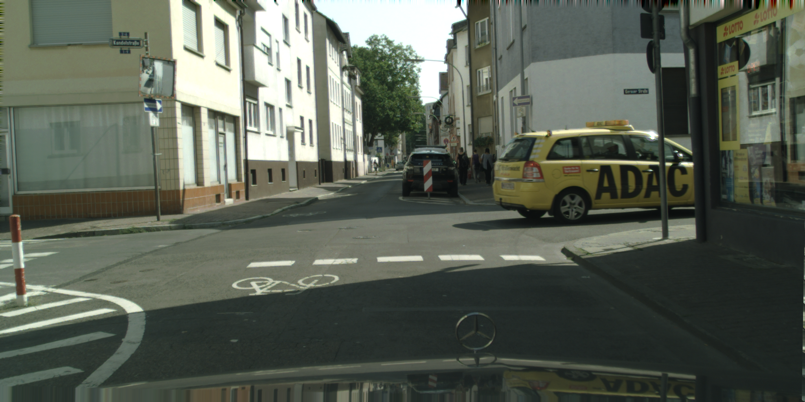
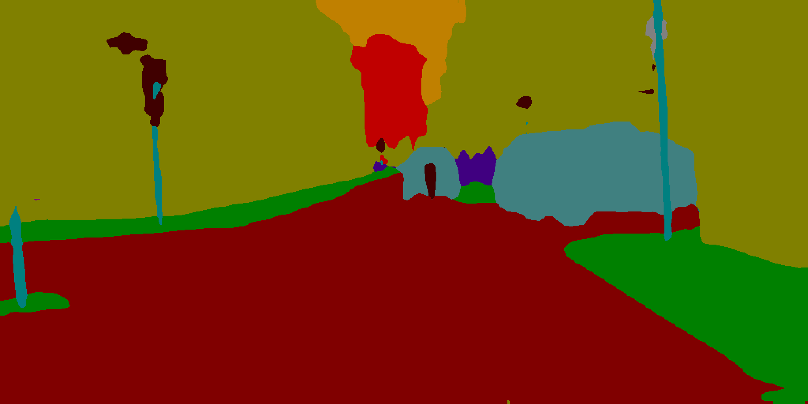

# PP-LiteSeg: A Superior Real-Time Semantic Segmentation Model

## Input



(Image from https://www.cityscapes-dataset.com/downloads/)

- cityscapes: (1, 3, 512, 1024)
- camvid: (1, 3, 768, 1024)

## Output




## Usage
Automatically downloads the onnx and prototxt files on the first run.
It is necessary to be connected to the Internet while downloading.

For the sample image,
```bash
$ python3 pp_liteseg.py
```

If you want to specify the input image, put the image path after the `--input` option.  
You can use `--savepath` option to change the name of the output file to save.
```bash
$ python3 pp_liteseg.py --input IMAGE_PATH --savepath SAVE_IMAGE_PATH
```

By adding the `--video` option, you can input the video.   
If you pass `0` as an argument to VIDEO_PATH, you can use the webcam input instead of the video file.
```bash
$ python3 pp_liteseg.py --video VIDEO_PATH
```

By adding the `--model_type` option, you can specify model type which is selected from "stdc1", "stdc2". (default is stdc1)
```bash
$ python3 pp_liteseg.py --model_type stdc1
```

By adding the `--dataset` option, you can specify model type (dataset) which is selected from "cityscapes", "camvid". (default is cityscapes)
```bash
$ python3 pp_liteseg.py --dataset cityscapes
```

## Reference

- [PaddleSeg](https://github.com/PaddlePaddle/PaddleSeg)
- [PP-LiteSeg: A Superior Real-Time Semantic Segmentation Model](https://github.com/PaddlePaddle/PaddleSeg/tree/develop/configs/pp_liteseg)

## Framework

Pytorch

## Model Format

ONNX opset=11

## Netron

[pp_liteseg_stdc1_cityscapes_1024x512_scale1.0.model.onnx.prototxt](https://netron.app/?url=https://storage.googleapis.com/ailia-models/pp_liteseg/pp_liteseg_stdc1_cityscapes_1024x512_scale1.0_model.onnx.prototxt)  
[pp_liteseg_stdc2_cityscapes_1024x512_scale1.0.model.onnx.prototxt](https://netron.app/?url=https://storage.googleapis.com/ailia-models/pp_liteseg/pp_liteseg_stdc2_cityscapes_1024x512_scale1.0_model.onnx.prototxt)  
[pp_liteseg_stdc1_camvid_960x720_10k_model.onnx.prototxt](https://netron.app/?url=https://storage.googleapis.com/ailia-models/pp_liteseg/pp_liteseg_stdc1_camvid_960x720_10k_model.onnx.prototxt)  
[pp_liteseg_stdc2_camvid_960x720_10k_model.onnx.prototxt](https://netron.app/?url=https://storage.googleapis.com/ailia-models/pp_liteseg/pp_liteseg_stdc2_camvid_960x720_10k_model.onnx.prototxt)
