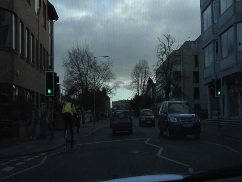

# PyTorch-ENet

## Input



(Image from CamVid Dataset https://github.com/alexgkendall/SegNet-Tutorial/tree/master/CamVid)

#### CamVid
Shape : (1, 3, 360, 480)  
#### Cityscapes
Shape : (1, 3, 512, 1024)

## Output

#### CamVid


Shape : (1, 12, 360, 480)  

#### Cityscapes

Shape : (1, 20, 512, 1024)  

### Category

#### CamVid
```
CATEGORY = [
  'sky', 'building', 'pole', 'road_marking', 'road', 'pavement', 
  'tree', 'sign_symbol', 'fence', 'car', 'pedestrian', 'bicyclist', 'unlabeled', 
]
```
#### Cityscapes
```
CATEGORY = [
  'unlabeled', 'road', 'sidewalk', 'building', 'wall',
  'fence', 'pole', 'traffic_light', 'traffic_sign', 'vegetation', 
  'terrain', 'sky', 'person', 'rider', 'car', 
  'truck', 'bus', 'train', 'motorcycle', 'bicycle',
]
```

### Usage
Automatically downloads the onnx and prototxt files on the first run.
It is necessary to be connected to the Internet while downloading.

For the sample image,
```bash
$ python3 pytorch-enet.py
```

If you want to specify the input image, put the image path after the `--input` option.  
You can use `--savepath` option to change the name of the output file to save.
```bash
$ python3 pytorch-enet.py --input IMAGE_PATH --savepath SAVE_IMAGE_PATH
```

By adding the `--video` option, you can input the video.   
If you pass `0` as an argument to VIDEO_PATH, you can use the webcam input instead of the video file.
```bash
$ python3 pytorch-enet.py --video VIDEO_PATH
```

By adding the `--model_type` option, you can specify mdoel type which is selected from "camvid", "cityscapes".  
(default is camvid)
```bash
$ python3 pytorch-enet --model_type camvid
```

## Reference

- [PyTorch-ENet](https://github.com/davidtvs/PyTorch-ENet)

## Framework

Pytorch

## Model Format

ONNX opset=11

## Netron

[enet_camvid.onnx.prototxt](https://netron.app/?url=https://storage.googleapis.com/ailia-models/pythorch-enet/enet_camvid.onnx.prototxt)  
[enet_cityscapes.onnx.prototxt](https://netron.app/?url=https://storage.googleapis.com/ailia-models/pythorch-enet/enet_cityscapes.onnx.prototxt)  
