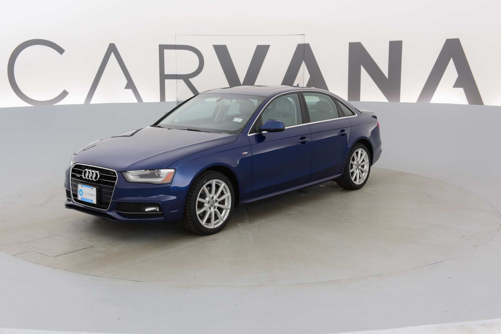
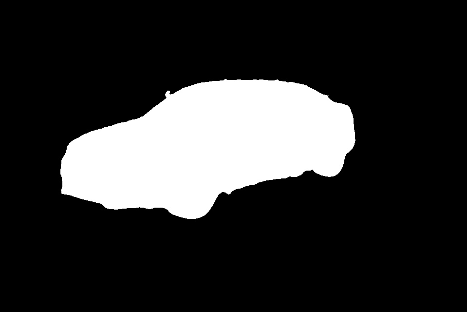

# Pytorch-Unet

## Input



(Image above are from [https://www.kaggle.com/c/carvana-image-masking-challenge/data](https://www.kaggle.com/c/carvana-image-masking-challenge/data))

## Output



## Usage
Automatically downloads the onnx and prototxt files on the first run.
It is necessary to be connected to the Internet while downloading.

For the sample image,
```
$ python3 pytorch-unet.py
```

If you want to specify the input image, put the image path after the `--input` option.  
You can use `--savepath` option to change the name of the output file to save.
```
$ python3 pytorch-unet --input IMAGE_PATH --savepath SAVE_IMAGE_PATH
```

By adding the `--video` option, you can input the video.   
If you pass `0` as an argument to VIDEO_PATH, you can use the webcam input instead of the video file.
```
$ python3 pytorch-unet.py --video VIDEO_PATH
```

## Reference

- [Pytorch-Unet](https://github.com/milesial/Pytorch-UNet)

## Framework

PyTorch

## Model Format

ONNX opset=11

## Netron

[pytorch-unet.onnx.prototxt](https://storage.googleapis.com/ailia-models/pytorch-unet/pytorch-unet.onnx.prototxt)

