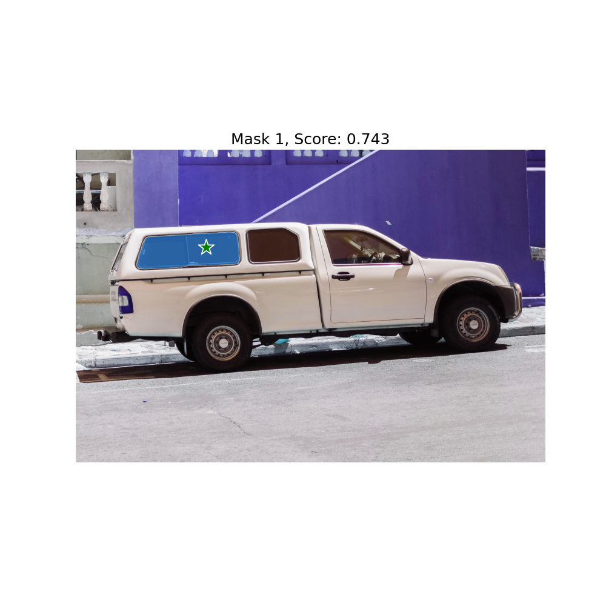

# Segment Anything 2

## Input


(Image from https://github.com/facebookresearch/segment-anything/blob/main/notebooks/images/truck.jpg)

## Output

- 1 positive point


## Usage
Automatically downloads the onnx and prototxt files on the first run.
It is necessary to be connected to the Internet while downloading.

For the sample image,
```bash
$ python3 segment-anything-2.py
```

If you want to specify the input image, put the image path after the `--input` option.  
You can use `--savepath` option to change the name of the output file to save.
```bash
$ python3 segment-anything-2.py --input IMAGE_PATH --savepath SAVE_IMAGE_PATH
```

If you want to specify the positive point, put the coordinates(x,y) after the `--pos` option.
```bash
$ python3 segment-anything-2.py --pos 500 375
```

And if you want to specify the negative point, put the coordinates after the `--neg` option.
```bash
$ python3 segment-anything-2.py --pos 500 375 --neg 360 405
```

If you want to specify the box, put the coordinates(x1,y1,x2,y2) after the `--box` option.
```bash
$ python3 segment-anything-2.py --box 425 600 700 875
```

These options can be combined.
```bash
$ python3 segment-anything-2.py --pos 500 375 --pos 1125 625
```

```bash
$ python3 segment-anything-2.py --box 425 600 700 875 --neg 575 750
```

By adding the `--model_type` option, you can specify model type which is selected from "hiera_l",  "hiera_b+",  "hiera_s", and "hiera_t". (default is hiera_l)
```bash
$ python3 segment-anything-2.py --model_type hiera_l
```

## Reference

- [Segment Anything 2](https://github.com/facebookresearch/segment-anything-2)

## Framework

Pytorch

## Model Format

ONNX opset=17

## Netron

- [image_encoder_hiera_l.onnx.prototxt](https://netron.app/?url=https://storage.googleapis.com/ailia-models/segment-anything-2/image_encoder_hiera_l.onnx.prototxt)  
- [mask_decoder_hiera_l.onnx.prototxt](https://netron.app/?url=https://storage.googleapis.com/ailia-models/segment-anything-2/mask_decoder_hiera_l.onnx.prototxt)  
- [prompt_encoder_hiera_l.onnx.prototxt](https://netron.app/?url=https://storage.googleapis.com/ailia-models/segment-anything-2/prompt_encoder_hiera_l.onnx.prototxt)  
- [memory_attention_hiera_l.onnx.prototxt](https://netron.app/?url=https://storage.googleapis.com/ailia-models/segment-anything-2/memory_attention_hiera_l.onnx.prototxt)  
- [memory_encoder_hiera_l.onnx.prototxt](https://netron.app/?url=https://storage.googleapis.com/ailia-models/segment-anything-2/memory_encoder_hiera_l.onnx.prototxt)  

- [image_encoder_hiera_b+.onnx.prototxt](https://netron.app/?url=https://storage.googleapis.com/ailia-models/segment-anything-2/image_encoder_hiera_b+.onnx.prototxt)  
- [mask_decoder_hiera_b+.onnx.prototxt](https://netron.app/?url=https://storage.googleapis.com/ailia-models/segment-anything-2/mask_decoder_hiera_b+.onnx.prototxt)  
- [prompt_encoder_hiera_b+.onnx.prototxt](https://netron.app/?url=https://storage.googleapis.com/ailia-models/segment-anything-2/prompt_encoder_hiera_b+.onnx.prototxt)  
- [memory_attention_hiera_b+.onnx.prototxt](https://netron.app/?url=https://storage.googleapis.com/ailia-models/segment-anything-2/memory_attention_hiera_b+.onnx.prototxt)  
- [memory_encoder_hiera_b+.onnx.prototxt](https://netron.app/?url=https://storage.googleapis.com/ailia-models/segment-anything-2/memory_encoder_hiera_b+.onnx.prototxt)  

- [image_encoder_hiera_s.onnx.prototxt](https://netron.app/?url=https://storage.googleapis.com/ailia-models/segment-anything-2/image_encoder_hiera_s.onnx.prototxt)  
- [mask_decoder_hiera_s.onnx.prototxt](https://netron.app/?url=https://storage.googleapis.com/ailia-models/segment-anything-2/mask_decoder_hiera_s.onnx.prototxt)  
- [prompt_encoder_hiera_s.onnx.prototxt](https://netron.app/?url=https://storage.googleapis.com/ailia-models/segment-anything-2/prompt_encoder_hiera_s.onnx.prototxt)  
- [memory_attention_hiera_s.onnx.prototxt](https://netron.app/?url=https://storage.googleapis.com/ailia-models/segment-anything-2/memory_attention_hiera_s.onnx.prototxt)  
- [memory_encoder_hiera_s.onnx.prototxt](https://netron.app/?url=https://storage.googleapis.com/ailia-models/segment-anything-2/memory_encoder_hiera_s.onnx.prototxt)  

- [image_encoder_hiera_t.onnx.prototxt](https://netron.app/?url=https://storage.googleapis.com/ailia-models/segment-anything-2/image_encoder_hiera_t.onnx.prototxt)  
- [mask_decoder_hiera_t.onnx.prototxt](https://netron.app/?url=https://storage.googleapis.com/ailia-models/segment-anything-2/mask_decoder_hiera_t.onnx.prototxt)  
- [prompt_encoder_hiera_t.onnx.prototxt](https://netron.app/?url=https://storage.googleapis.com/ailia-models/segment-anything-2/prompt_encoder_hiera_t.onnx.prototxt)  
- [memory_attention_hiera_t.onnx.prototxt](https://netron.app/?url=https://storage.googleapis.com/ailia-models/segment-anything-2/memory_attention_hiera_t.onnx.prototxt)  
- [memory_encoder_hiera_t.onnx.prototxt](https://netron.app/?url=https://storage.googleapis.com/ailia-models/segment-anything-2/memory_encoder_hiera_t.onnx.prototxt)  
