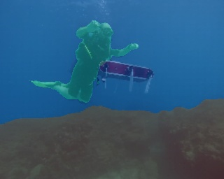

# Suim

## Input


(Image from https://github.com/IRVLab/SUIM/blob/master/data/test/images/d_r_47_.jpg)

## Output



## Usage

Automatically downloads the onnx and prototxt files on the first run.
It is necessary to be connected to the Internet while downloading.

For the sample image,
``` bash
$ python3 suim.py
```

If you want to specify the input image, put the image path after the `--input` option.  
You can use `--savepath` option to change the name of the output file to save.
```bash
$ python3 suim.py --input IMAGE_PATH --savepath SAVE_IMAGE_PATH
```

By adding the `--video` option, you can input the video.   
If you pass `0` as an argument to VIDEO_PATH, you can use the webcam input instead of the video file.
```bash
$ python3 suim.py --video VIDEO_PATH
```

The default setting is to use the optimized model and weights, but you can also switch to the normal model by using the --normal option.

## Reference

[SUIM](https://github.com/IRVLab/SUIM)

## Framework

keras==2.1.1

## Model Format

ONNX opset = 11

## Netron

[suim.opt.onnx.prototxt](https://netron.app/?url=https://storage.googleapis.com/ailia-models/swiftnet/swiftnet.opt.onnx.prototxt)
