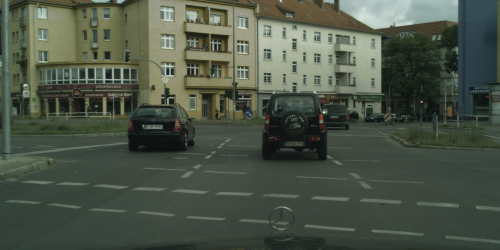
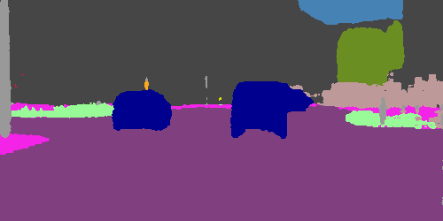

# TuSimple-DUC

## Input



(Image from https://www.cityscapes-dataset.com/)

/datasets/Cityscapes/rgb/test/munich/munich_000000_000019_leftImg8bit.png

Ailia input shape: (1, 3, 1024, 2048)

## Output



## Usage

Automatically downloads the onnx and prototxt files on the first run.
It is necessary to be connected to the Internet while downloading.

For the sample image,
``` bash
$ python3 tusimple-DUC.py
```

If you want to specify the input image, put the image path after the `--input` option.  
You can use `--savepath` option to change the name of the output file to save.
```bash
$ python3 tusimple-DUC.py --input IMAGE_PATH --savepath SAVE_IMAGE_PATH
```

By adding the `--video` option, you can input the video.   
If you pass `0` as an argument to VIDEO_PATH, you can use the webcam input instead of the video file.
```bash
$ python3 tusimple-DUC.py --video VIDEO_PATH
```

## Reference

[TuSimple-DUC](https://github.com/TuSimple/TuSimple-DUC)

## Framework

Pytorch

## Model Format

ONNX opset = 12

## Netron

[swiftnet.onnx.prototxt](https://netron.app/?url=https://storage.googleapis.com/ailia-models/tusimple-DUC/ResNet101-DUC-12.onnx.prototxt)
