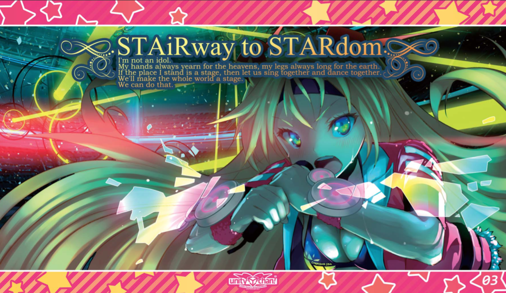

# Yet-Another-Anime-Segmenter

## Input



(Image from https://unity-chan.com/download/index.php and licensed under
© Unity Technologies Japan/UCL)

- ailia input shape: (1, 3, height, width) RGB channel order
  - Accepts any raw image height and width but needs to be resized and padded
  accordingly (see `preprocessing` method)
- Pixel value range: Normalized values (see `preprocessing` method)

## Output


- ailia Predict API output: Raw classification, kernel and mask predictions
- With helper functions, classification scores, predicted classes, predicted
masks, predicted bounding boxes can be obtained.

## Usage

Automatically downloads the onnx and prototxt files on the first run.
It is necessary to be connected to the Internet while downloading.

For the sample image,
``` bash
$ python3 yet-another-anime-segmenter.py 
```

If you want to specify the input image, put the image path after the `--input` option.  
You can use `--savepath` option to change the name of the output file to save.
```bash
$ python3 yet-another-anime-segmenter.py --input IMAGE_PATH --savepath SAVE_IMAGE_PATH
```

By adding the `--video` option, you can input the video.   
If you pass `0` as an argument to VIDEO_PATH, you can use the webcam input instead of the video file.
```bash
$ python3 yet-another-anime-segmenter.py --video VIDEO_PATH --savepath SAVE_VIDEO_PATH
```

To use the ONNX Runtime instead of ailia.
```bash
$ python3 yet-another-anime-segmenter.py --onnx
```

## Reference

- [Yet-Another-Anime-Segmenter](https://github.com/zymk9/Yet-Another-Anime-Segmenter)
- [AdelaiDet](https://github.com/aim-uofa/AdelaiDet)
- [detectron2](https://github.com/facebookresearch/detectron2)

## Framework

PyTorch 1.7.1


## Model Format

ONNX opset = 11

## Netron

[yaas_solov2.onnx.prototxt](https://storage.googleapis.com/ailia-models/yaas_solov2/yaas_solov2.onnx.prototxt)
