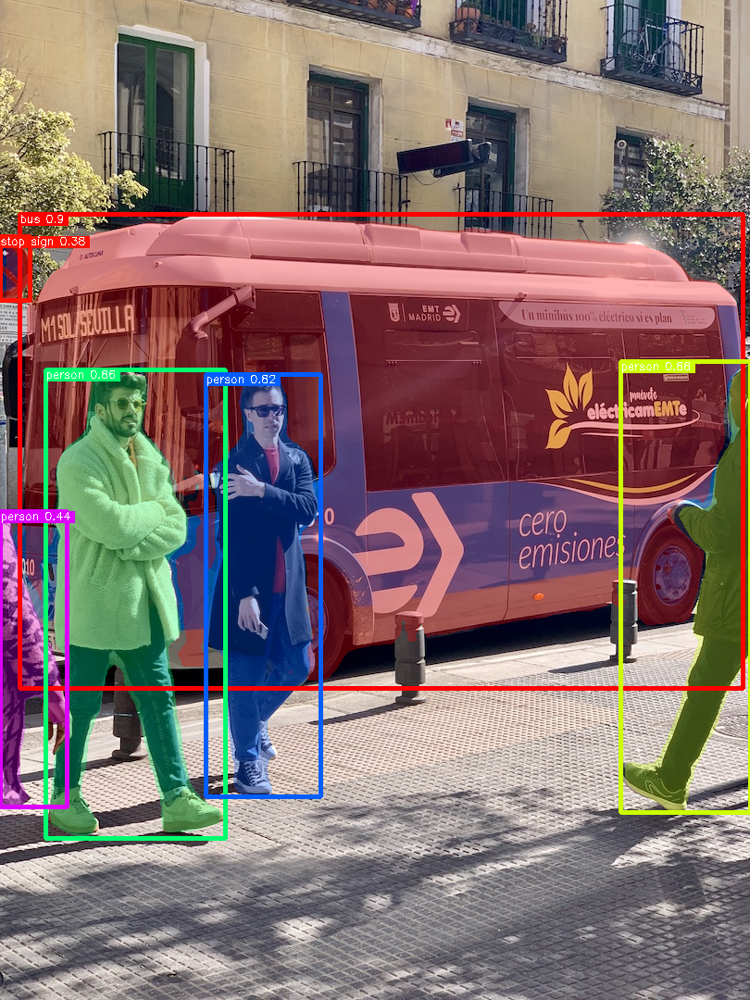

# YOLO11 Segmentation

## Input


(Image from https://ultralytics.com/images/bus.jpg)

## Output



## Usage
Automatically downloads the onnx and prototxt files on the first run.
It is necessary to be connected to the Internet while downloading.

For the sample image,
```bash
$ python3 yolov11-seg.py
```

If you want to specify the input image, put the image path after the `--input` option.  
You can use `--savepath` option to change the name of the output file to save.
```bash
$ python3 yolov11-seg.py --input IMAGE_PATH --savepath SAVE_IMAGE_PATH
```

By adding the `--video` option, you can input the video.   
If you pass `0` as an argument to VIDEO_PATH, you can use the webcam input instead of the video file.
```bash
$ python3 yolov11-seg.py --video VIDEO_PATH
```

By adding the `--model_type` option, you can specify model type which is selected from "11n", "11s", "11m", "11l", "11x". (default is 11n)
```bash
$ python3 yolov11-seg.py --model_type 11n
```

## Reference

- [Ultralytics YOLO11](https://github.com/ultralytics/ultralytics)

## Framework

Pytorch

## Model Format

ONNX opset=17

## Netron

[yolo11n-seg.onnx.prototxt](https://netron.app/?url=https://storage.googleapis.com/ailia-models/yolov11-seg/yolo11n-seg.onnx.prototxt)  
[yolo11s-seg.onnx.prototxt](https://netron.app/?url=https://storage.googleapis.com/ailia-models/yolov11-seg/yolo11s-seg.onnx.prototxt)  
[yolo11m-seg.onnx.prototxt](https://netron.app/?url=https://storage.googleapis.com/ailia-models/yolov11-seg/yolo11m-seg.onnx.prototxt)  
[yolo11l-seg.onnx.prototxt](https://netron.app/?url=https://storage.googleapis.com/ailia-models/yolov11-seg/yolo11l-seg.onnx.prototxt)  
[yolo11x-seg.onnx.prototxt](https://netron.app/?url=https://storage.googleapis.com/ailia-models/yolov11-seg/yolo11x-seg.onnx.prototxt)
