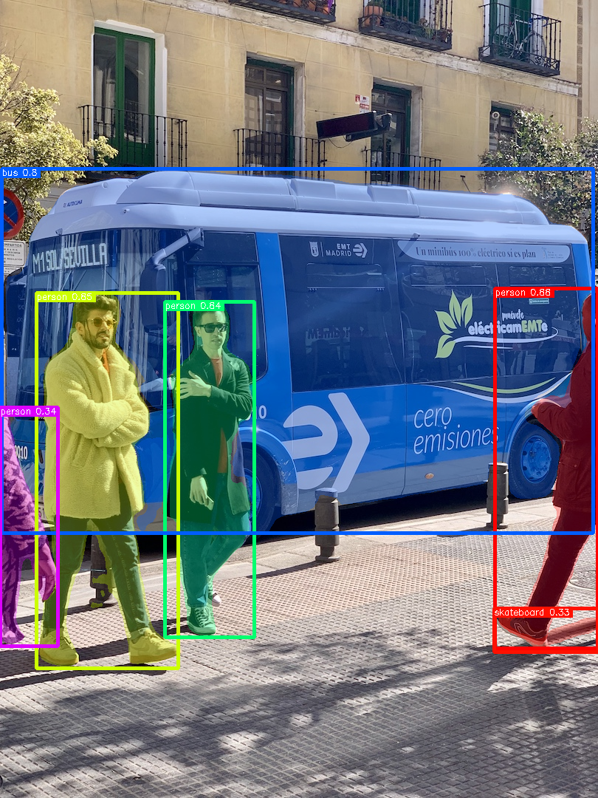

# YOLOv8 Segmentation

## Input


(Image from https://ultralytics.com/images/bus.jpg)

## Output



## Usage
Automatically downloads the onnx and prototxt files on the first run.
It is necessary to be connected to the Internet while downloading.

For the sample image,
```bash
$ python3 yolov8-seg.py
```

If you want to specify the input image, put the image path after the `--input` option.  
You can use `--savepath` option to change the name of the output file to save.
```bash
$ python3 yolov8-seg.py --input IMAGE_PATH --savepath SAVE_IMAGE_PATH
```

By adding the `--video` option, you can input the video.   
If you pass `0` as an argument to VIDEO_PATH, you can use the webcam input instead of the video file.
```bash
$ python3 yolov8-seg.py --video VIDEO_PATH
```

By adding the `--model_type` option, you can specify model type which is selected from "v8n", "v8s", "v8m", "v8l", "v8x". (default is v8n)
```bash
$ python3 yolov8-seg.py --model_type v8n
```

## Reference

- [Ultralytics YOLOv8](https://github.com/ultralytics/ultralytics)

## Framework

Pytorch

## Model Format

ONNX opset=11

## Netron

[yolov8n-seg.onnx.prototxt](https://netron.app/?url=https://storage.googleapis.com/ailia-models/yolov8/yolov8n-seg.onnx.prototxt)  
[yolov8s-seg.onnx.prototxt](https://netron.app/?url=https://storage.googleapis.com/ailia-models/yolov8/yolov8s-seg.onnx.prototxt)  
[yolov8m-seg.onnx.prototxt](https://netron.app/?url=https://storage.googleapis.com/ailia-models/yolov8/yolov8m-seg.onnx.prototxt)  
[yolov8l-seg.onnx.prototxt](https://netron.app/?url=https://storage.googleapis.com/ailia-models/yolov8/yolov8l-seg.onnx.prototxt)  
[yolov8x-seg.onnx.prototxt](https://netron.app/?url=https://storage.googleapis.com/ailia-models/yolov8/yolov8x-seg.onnx.prototxt)
