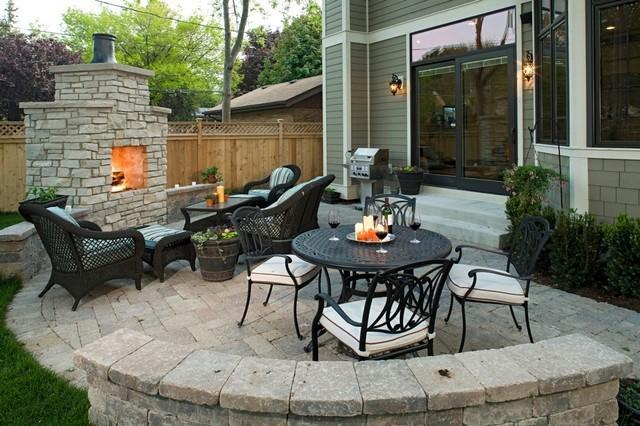

# Places365

### Input


from https://github.com/CSAILVision/places365

Ailia input shape: (1, 3, 224, 224) 


### Output
If model type is resnet18, resnet50 or alexnet, result is as below. 
```
--SCENE CATEGORIES:
	0.616 -> patio
	0.314 -> restaurant_patio
	0.020 -> beer_garden
	0.011 -> courtyard
	0.011 -> porch
```

If model type is wideresnet18, result is as below and class activation map is generated.
```
--TYPE OF ENVIRONMENT:
	outdoor
--SCENE CATEGORIES:
	0.651 -> patio
	0.068 -> restaurant_patio
	0.043 -> porch
	0.026 -> courtyard
	0.022 -> picnic_area
--SCENE ATTRIBUTES:
	 man-made, no horizon, natural light, open area, foliage, wood, vegetation, leaves, trees
```

Class activation map


### Usage
Automatically downloads the onnx and prototxt files on the first run.
It is necessary to be connected to the Internet while downloading.

For the sample image,
``` bash
$ python3 places365.py
```

If you want to specify the input image, put the image path after the `--input` option.  
```bash
$ python3 places365.py --input IMAGE_PATH
```

By adding the `--video` option, you can input the video.   
If you pass `0` as an argument to VIDEO_PATH, you can use the webcam input instead of the video file.
```bash
$ python3 places365.py --video VIDEO_PATH
```

You can select a model from `resnet18 | resnet50 | alexnet | wideresnet18` by adding `--model` option.

In the case of `wideresnet18` model, you can use `--savepath` option to save the class activation map file.
```bash
(ex1)$ python3 places365.py --model wideresnet18 --input IMAGE_PATH --savepath SAVE_IMAGE_PATH

(ex2)$ python3 places365.py --model wideresnet18 --video VIDEO_PATH --savepath SAVE_VIDEO_PATH
```

### Assets
[categories_places365.txt](https://raw.githubusercontent.com/csailvision/places365/master/categories_places365.txt)

[IO_places365.txt](https://raw.githubusercontent.com/csailvision/places365/master/IO_places365.txt)

[labels_sunattribute.txt](https://raw.githubusercontent.com/csailvision/places365/master/labels_sunattribute.txt)

[W_sceneattribute_wideresnet18.npy](http://places2.csail.mit.edu/models_places365/W_sceneattribute_wideresnet18.npy)

### Reference
[Places: A 10 million Image Database for Scene Recognition](http://places2.csail.mit.edu/index.html)

[Release of Places365-CNNs](https://github.com/CSAILVision/places365)

### Framework

PyTorch 1.2.0

### Model Format
ONNX opset = 11 

### Netron

[resnet18_places365.onnx.prototxt](https://netron.app/?url=https://storage.googleapis.com/ailia-models/places365/resnet18_places365.onnx.prototxt)

[resnet50_places365.onnx.prototxt](https://netron.app/?url=https://storage.googleapis.com/ailia-models/places365/resnet50_places365.onnx.prototxt)

[alexnet_places365.onnx.prototxt](https://netron.app/?url=https://storage.googleapis.com/ailia-models/places365/alexnet_places365.onnx.prototxt)

[wideresnet18_places365.onnx.prototxt](https://netron.app/?url=https://storage.googleapis.com/ailia-models/places365/wideresnet18_places365.onnx.prototxt)
