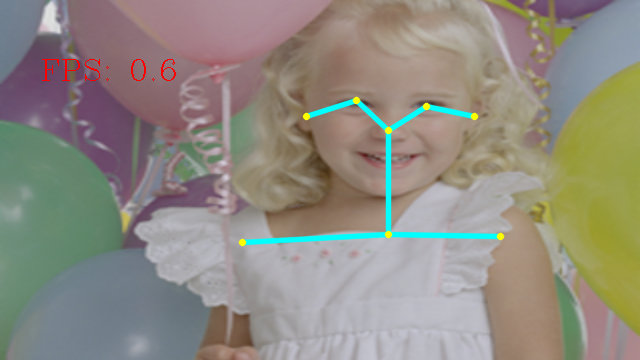
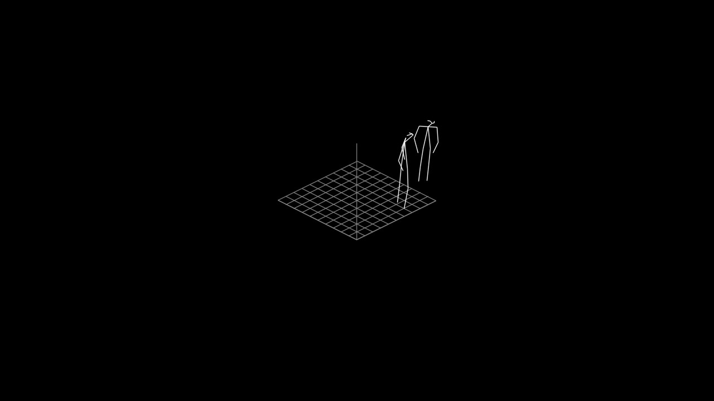

# Light Weight Human Pose Estimation 3D Demo

### input


Ailia input shape(1, 3,	256, 448)  
Range:[-1, 1]

### output





### usage
Automatically downloads the onnx and prototxt files on the first run.
It is necessary to be connected to the Internet while downloading.

For the sample image,
``` bash
$ python3 lightweight-human-pose-estimation-3d.py
```

Argument `--rotate3d` to activate 3d-canvas-rotation-mode.  

If you want to specify the input image, put the image path after the `--input` option.  
You can use `--savepath` option to change the name of the output file to save.
```bash
$ python3 lightweight-human-pose-estimation-3d.py --input IMAGE_PATH --savepath SAVE_IMAGE_PATH
```

By adding the `--video` option, you can input the video.   
If you pass `0` as an argument to VIDEO_PATH, you can use the webcam input instead of the video file.
```bash
$ python3 lightweight-human-pose-estimation-3d.py --video VIDEO_PATH
```


### Reference

[Real-time 3D multi-person pose estimation demo in PyTorch. OpenVINO backend can be used for fast inference on CPU.](https://github.com/Daniil-Osokin/lightweight-human-pose-estimation-3d-demo.pytorch)


### Framework
PyTorch 1.0


### Model Format
ONNX opset = 10


### Netron

[lightweight-human-pose-estimation-3d.onnx.prototxt](https://lutzroeder.github.io/netron/?url=https://storage.googleapis.com/ailia-models/lightweight-human-pose-estimation-3d/human-pose-estimation-3d.onnx.prototxt)
