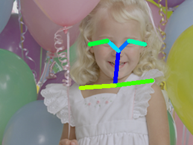

# lightweight-human-pose-estimation

## Input

Shape : (1, 3, 240, 320)
Range : [0.0, 1.0]

## Output

Confidence : (1, 19, 30, 40)
Paf : (1, 38,  30, 40)
Range : [0, 1.0]

## Reference

[Fast and accurate human pose estimation in PyTorch. Contains implementation of "Real-time 2D Multi-Person Pose Estimation on CPU: Lightweight OpenPose" paper.](https://github.com/Daniil-Osokin/lightweight-human-pose-estimation.pytorch)

## Framework

Pytorch 1.2.0

## Model Format

ONNX opset = 10
