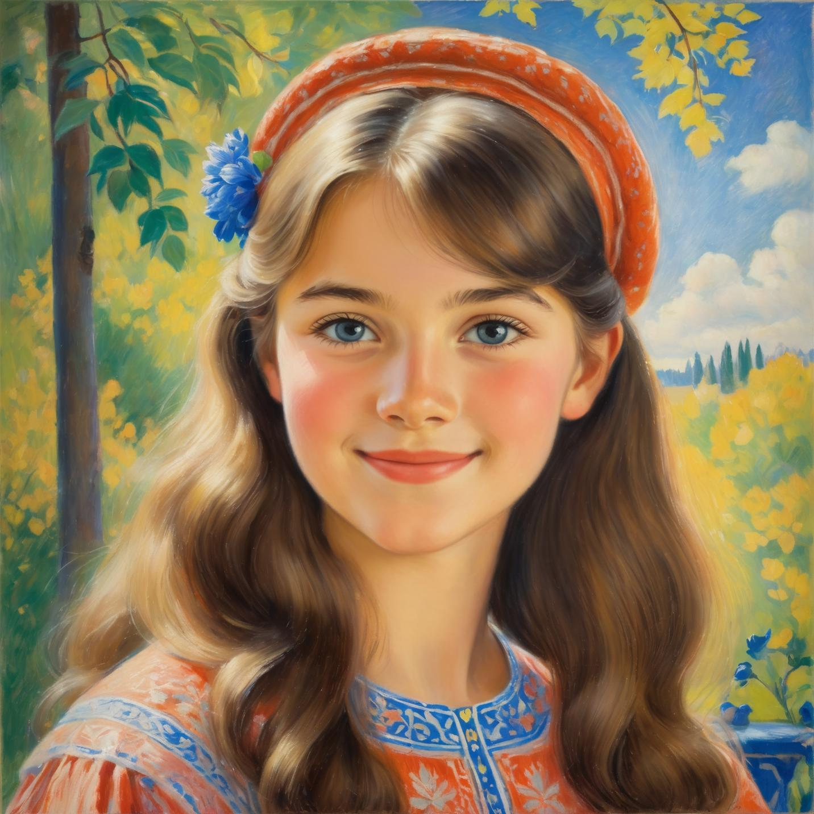

# Hallo: Hierarchical Audio-Driven Visual Synthesis for Portrait Image Animation

## Input

- Image file:

  

  (Image from https://rrc.cvc.uab.es/?ch=4&com=downloads)

- Audio file:

  https://github.com/fudan-generative-vision/hallo/blob/main/examples/driving_audios/1.wav

## Output

Video file

## Requirements
This model requires additional module.

```
pip3 install insightface==0.7.3
pip3 install librosa
pip3 install moviepy==1.0.3
pip3 install transformers
```

## Usage
Automatically downloads the onnx and prototxt files on the first run.
It is necessary to be connected to the Internet while downloading.

For the sample image, audio,
```bash
$ python3 hallo.py
```

If you want to specify the image and audio files, put the file paths after the `--input` and `--driving_audio` options.  
You can use the `--savepath` option to change the name of the output file to save.
```bash
$ python3 hallo.py --input IMAGE_FILE --driving_audio AUDIO_FILE --savepath OUTPUT_FILE
```

## Reference

- [hallo](https://github.com/fudan-generative-vision/hallo)

## Framework

Pytorch

## Model Format

ONNX opset=17

## Netron

[vae_encoder.onnx.prototxt](https://netron.app/?url=https://storage.googleapis.com/ailia-models/hallo/vae_encoder.onnx.prototxt)  
[vae_decoder.onnx.prototxt](https://netron.app/?url=https://storage.googleapis.com/ailia-models/hallo/vae_decoder.onnx.prototxt)  
[audio_encoder.onnx.prototxt](https://netron.app/?url=https://storage.googleapis.com/ailia-models/hallo/audio_encoder.onnx.prototxt)  
[reference_unet.onnx.prototxt](https://netron.app/?url=https://storage.googleapis.com/ailia-models/hallo/reference_unet.onnx.prototxt)  
[denoising_unet.onnx.prototxt](https://netron.app/?url=https://storage.googleapis.com/ailia-models/hallo/denoising_unet.onnx.prototxt)  
[face_locator.onnx.prototxt](https://netron.app/?url=https://storage.googleapis.com/ailia-models/hallo/face_locator.onnx.prototxt)  
[audio_proj.onnx.prototxt](https://netron.app/?url=https://storage.googleapis.com/ailia-models/hallo/audio_proj.onnx.prototxt)  
[image_proj.onnx.prototxt](https://netron.app/?url=https://storage.googleapis.com/ailia-models/hallo/image_proj.onnx.prototxt)  
