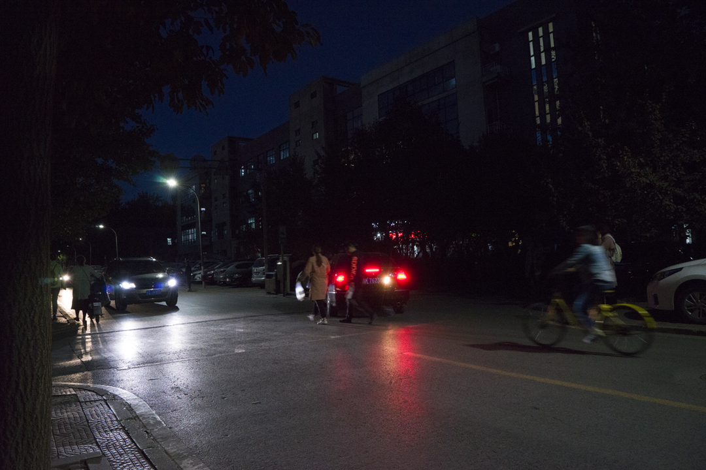
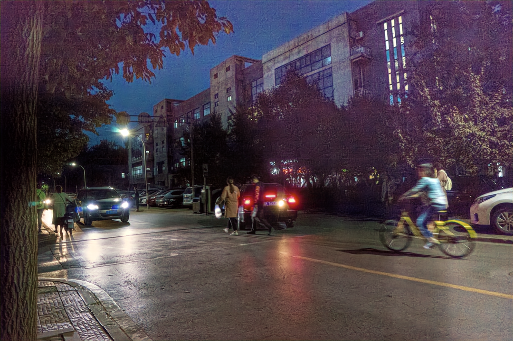

# AGLLNet

## Input


(Image from https://github.com/yu-li/AGLLNet/blob/main/input/5047.png)

Ailia input shape: (1, 3, 768, 1152)

## Output



## Usage
Automatically downloads the onnx and prototxt files on the first run.
It is necessary to be connected to the Internet while downloading.

For the sample image,
``` bash
python3 agllnet.py 
```

If you want to specify the input image, put the image path after the `--input` option.  
You can use `--savepath` option to change the name of the output file to save.
```bash
$ python3 agllnet.py --input IMAGE_PATH --savepath SAVE_IMAGE_PATH
```

By adding the `--video` option, you can input the video. 
If you pass `0` as an argument to VIDEO_PATH, you can use the webcam input instead of the video file.
```bash
$ python3 agllnet.py --video VIDEO_PATH
```

## Reference
[AGLLNet: Attention Guided Low-light Image Enhancement (IJCV 2021)](https://github.com/yu-li/AGLLNet)

## Framework
Tensorflow 1.8.0

## Model Format
ONNX opset = 12

## Netron

[AGLLNet.onnx.prototxt](https://netron.app/?url=https://storage.googleapis.com/ailia-models/agllnet/AGLLNet.opt.onnx.prototxt)
