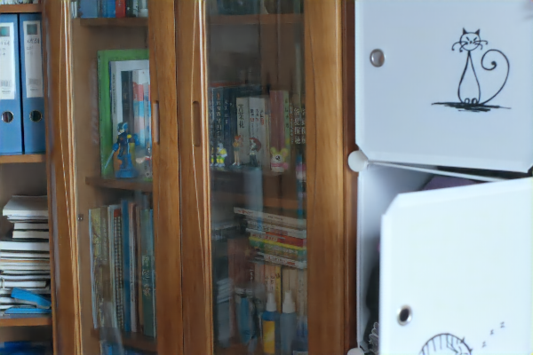
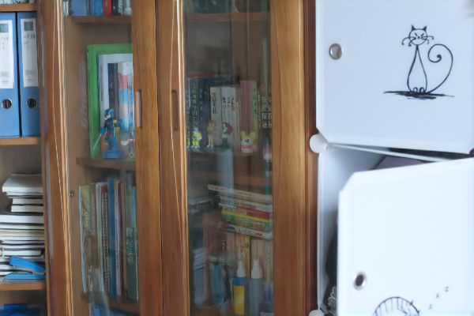

# DRBN SKF

## Input


(Image from https://github.com/yu-li/AGLLNet/blob/main/input/5047.png)

Ailia input shape: (1, 3, 400, 600)

## Output
### V1



### V2



## Usege
Automaticaly downloads the onnx and prototxt files on the first run. 

It is necessary to be connected to the Internet while downloading.

For the sample image,
```bash
$ python3 drbn_skf.py
```

If you want to specify the input image, put the image path after the `--input` option. You can use `--savepath` option to change the name of the output file to save.
```bash
$ python3 drbn_skf.py --input IMAGE_PATH --savepath SAVE_IMAGE_PATH
```

By adding the `--video` option, you can input the video.
If you pass `0` as an argument to VIDEO_PATH, you can use the webcam input instead of the video file.
```bash
$ python3 drbn_skf.py --video VIDEO_PATH
```

DRBN SKF has version 1 and version 2. You can specify version to use `--version` option.
```bash
$ python3 drbn_skf.py --version VERSION
```

To use onnxruntime, set --onnx option.
```bash
$ python3 drbn_skf.py --onnx
```

## Reference
[DRBN SKF](https://github.com/langmanbusi/Semantic-Aware-Low-Light-Image-Enhancement/tree/main/DRBN_SKF)


## Framework
PyTorch 2.1.2

## Model Format
ONNX opset = 17

## Netron
[drbn_skf_lol_v1.onnx.prototxt](https://storage.googleapis.com/ailia-models/drbn_skf/drbn_slf_lol_v1.onnx.prototxt)

[drbn_skf_lol_v2.onnx.prototxt](https://storage.googleapis.com/ailia-models/drbn_skf/drbn_slf_lol_v2.onnx.prototxt)
