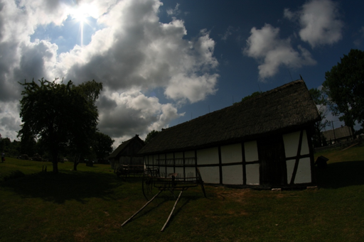
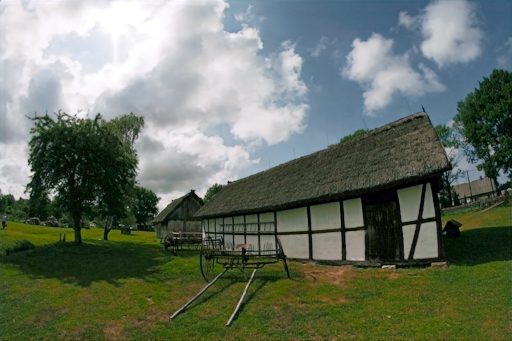

# GLADNet

## Input



(Image from https://github.com/weichen582/GLADNet/blob/master/data/eval/low/kluki1.png)

## Output



## Usage
Automatically downloads the onnx and prototxt files on the first run.
It is necessary to be connected to the Internet while downloading.

For the sample image,
```bash
$ python3 gladnet.py
```

If you want to specify the input image, put the image path after the `--input` option.  
You can use `--savepath` option to change the name of the output file to save.
```bash
$ python3 gladnet.py --input IMAGE_PATH --savepath SAVE_IMAGE_PATH
```

By adding the `--video` option, you can input the video.   
If you pass `0` as an argument to VIDEO_PATH, you can use the webcam input instead of the video file.
```bash
$ python3 gladnet.py --video VIDEO_PATH
```

## Reference

- [GLADNet](https://github.com/weichen582/GLADNet)

## Framework

Tensorflow

## Model Format

ONNX opset=11

## Netron

[GLADNet.onnx.prototxt](https://netron.app/?url=https://storage.googleapis.com/ailia-models/gladnet/GLADNet.onnx.prototxt)
