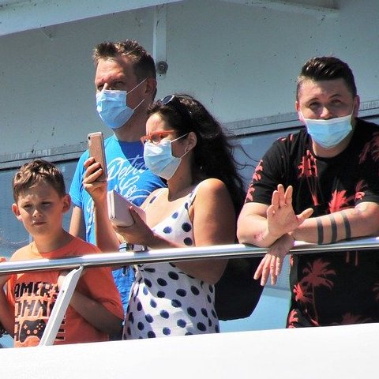

# masked-face-detection using YOLOv3

## Input



(Images from https://pixabay.com/ja/photos/%E3%83%95%E3%82%A7%E3%83%AA%E3%83%BC-%E8%88%B9-%E4%B9%97%E5%AE%A2-%E3%82%AF%E3%83%AB%E3%83%BC%E3%82%BA-5484417/)

Shape : (1, 3, 416, 416)
Range : [0.0, 1.0]

## Output


- category : [no_mask, mask]
- probablity : [0.0,1.0]
- position : x, y, w, h [0,1]

## usage
Automatically downloads the onnx and prototxt files on the first run.
It is necessary to be connected to the Internet while downloading.

For the sample image,
``` bash
$ python3 masked-face-detection.py
```

If you want to specify the input image, put the image path after the `--input` option.  
You can use `--savepath` option to change the name of the output file to save.
```bash
$ python3 masked-face-detection.py --input IMAGE_PATH --savepath SAVE_IMAGE_PATH
```

By adding the `--video` option, you can input the video.   
If you pass `0` as an argument to VIDEO_PATH, you can use the webcam input instead of the video file.
```bash
$ python3 ymasked-face-detection.py --video VIDEO_PATH
```

## Framework

Keras 2.2.4

## Model Format

ONNX opset=10 (Obfuscated by ailia SDK)

## Netron

[masked-face-detection.opt.onnx.prototxt](https://lutzroeder.github.io/netron/?url=https://storage.googleapis.com/ailia-models/masked-face-detection/masked-face-detection.opt.onnx.prototxt)
