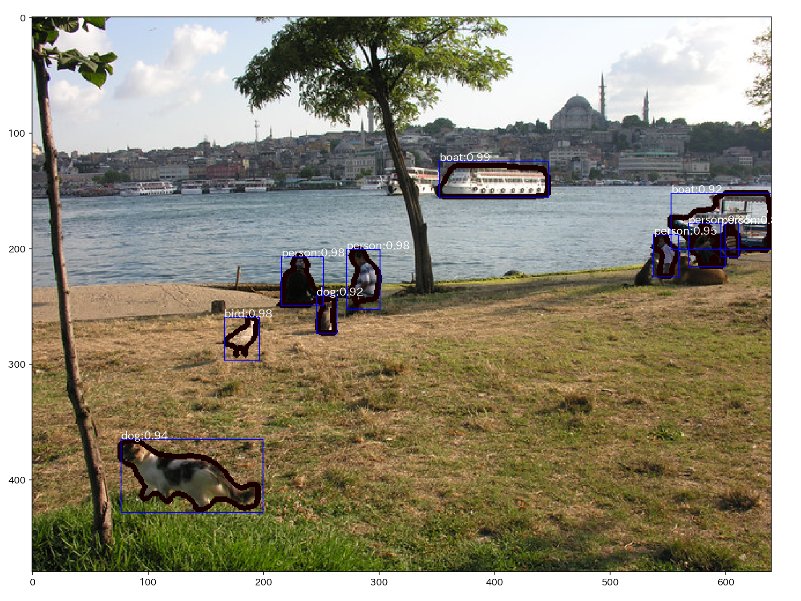

# Mask R-CNN

### input


### output


### usage
Automatically downloads the onnx and prototxt files on the first run.
It is necessary to be connected to the Internet while downloading.

For the sample image,
``` bash
$ python3 maskrcnn.py
```

If you want to specify the input image, put the image path after the `--input` option.  
You can use `--savepath` option to change the name of the output file to save.
```bash
$ python3 maskrcnn.py --input IMAGE_PATH --savepath SAVE_IMAGE_PATH
```

By adding the `--video` option, you can input the video.   
If you pass `0` as an argument to VIDEO_PATH, you can use the webcam input instead of the video file.
```bash
$ python3 maskrcnn.py --video VIDEO_PATH
```

### Reference

[Mask R-CNN](https://github.com/onnx/models/tree/master/vision/object_detection_segmentation/mask-rcnn)


### Framework


### Model Format
ONNX opset = 10


### Netron

[mask_rcnn_R_50_FPN_1x.onnx.prototxt](https://lutzroeder.github.io/netron/?url=https://storage.googleapis.com/ailia-models/mask_rcnn/mask_rcnn_R_50_FPN_1x.onnx.prototxt)
