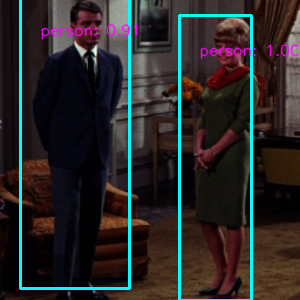

# Mobilenet_SSD

### input


Shape(1, 3, 300, 300) Range:[0, 1]

### output




### usage

``` bash
python3 mobilenet_ssd.py mb1-ssd
```
or
```bash
python3 mobilenet_ssd.py mb2-ssd-lite
```
you can change input image path and save image path in `mobilenet_ssd.py`


### Reference

[MobileNetV1, MobileNetV2, VGG based SSD/SSD-lite implementation in Pytorch](https://github.com/qfgaohao/pytorch-ssd)


### Framework
PyTorch 1.0 / 0.4


### Model Format
ONNX opset = 10


### Netron

[mb2-ssd-lite.onnx.onnx.prototxt](https://lutzroeder.github.io/netron/?url=https://storage.googleapis.com/ailia-models/mobilenet_ssd/mb2-ssd-lite.onnx.prototxt)

