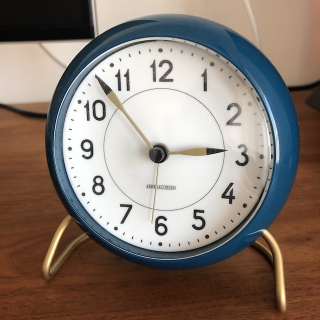

# MobilenetV2

## Input



Shape : (1,3,224,224)
Range : [0.0, 1.0]

## Output

```
class_count=3
+ idx=0
category=409[ analog clock ]
prob=16.436906814575195
+ idx=1
category=892[ wall clock ]
prob=15.828558921813965
+ idx=2
category=426[ barometer ]
prob=12.262958526611328
```

## Reference

[PyTorch Implemention of MobileNet V2](https://github.com/d-li14/mobilenetv2.pytorch)

## Model Format

ONNX opset = 10

## Framework

Pytorch 1.2.0
