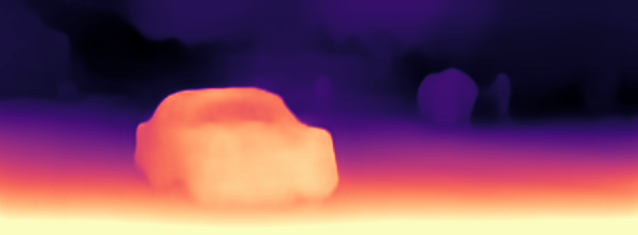

# MonoDepth2

### input


(Image from https://github.com/nianticlabs/monodepth2/tree/master/assets/test_image.jpg)

Ailia input shape(1, 3, 192, 640)  
Range:[0, 1]

### output



### Note

This Software is licensed under the terms of the following Monodepth2 license
which allows for non-commercial use only. For any other use of the software not
covered by the terms of this license, please contact partnerships@nianticlabs.com

### usage

### usage
Automatically downloads the onnx and prototxt files on the first run.
It is necessary to be connected to the Internet while downloading.

For the sample image,
``` bash
$ python3 monodepth2.py
```

If you want to specify the input image, put the image path after the `--input` option.  
You can use `--savepath` option to change the name of the output file to save.
```bash
$ python3 monodepth2.py --input IMAGE_PATH --savepath SAVE_IMAGE_PATH
```

By adding the `--video` option, you can input the video.   
If you pass `0` as an argument to VIDEO_PATH, you can use the webcam input instead of the video file.
```bash
$ python3 monodepth2.py --video VIDEO_PATH
```


### Reference

[Monocular depth estimation from a single image](https://github.com/nianticlabs/monodepth2)


### Framework
PyTorch 0.4.1


### Model Format
ONNX opset = 10


### Netron

[monodepth2_mono+stereo_640x192_enc.onnx.prototxt](https://lutzroeder.github.io/netron/?url=https://storage.googleapis.com/ailia-models/monodepth2/monodepth2_mono%2Bstereo_640x192_enc.onnx.prototxt)

[monodepth2_mono+stereo_640x192_dec.onnx.prototxt](https://lutzroeder.github.io/netron/?url=https://storage.googleapis.com/ailia-models/monodepth2/monodepth2_mono%2Bstereo_640x192_dec.onnx.prototxt)
