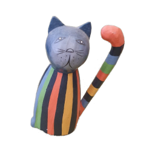

# LGM

## Input



(Image from https://github.com/3DTopia/LGM/blob/main/data_test/catstatue_rgba.png)

## Output


## Install
```
pip3 install -r requirements.txt

git clone https://github.com/MrSecant/diff-gaussian-rasterization.git c-diff-gaussian-rasterization
pip install -e ./c-diff-gaussian-rasterization
```

## Usage
Automatically downloads the onnx and prototxt files on the first run.
It is necessary to be connected to the Internet while downloading.

For the sample image,

``` bash
$ python3 lgm.py
```

If you want to specify the input point, put the .pts file path after the `--input` option.  
You can use `--savepath` option to change the name of the output file to save.

```bash
$ python3 lgm.py --input IMAGE_PATH --savepath SAVE_IMAGE_PATH
```

## Reference

- [LGM](https://github.com/3DTopia/LGM)

## Framework

Pytorch

## Model Format

ONNX opset=17

## Netron

[unet.onnx.prototxt](https://netron.app/?url=https://storage.googleapis.com/ailia-models/lgm/unet.onnx.prototxt)  
[text_encoder.onnx.prototxt](https://netron.app/?url=https://storage.googleapis.com/ailia-models/lgm/text_encoder.onnx.prototxt)  
[vae_encoder.onnx.prototxt](https://netron.app/?url=https://storage.googleapis.com/ailia-models/lgm/vae_encoder.onnx.prototxt)  
[vae_decoder.onnx.prototxt](https://netron.app/?url=https://storage.googleapis.com/ailia-models/lgm/vae_decoder.onnx.prototxt)  
[image_encoder.onnx.prototxt](https://netron.app/?url=https://storage.googleapis.com/ailia-models/lgm/image_encoder.onnx.prototxt)  
[lgm.onnx.prototxt](https://netron.app/?url=https://storage.googleapis.com/ailia-models/lgm/lgm.onnx.prototxt)  
