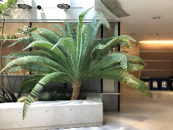

# NeRF

## Training Input

Multiple images for construct 3D model


(from https://drive.google.com/file/d/1P6KIDAr68twCJqcq2BJH6cgTOXXxAFIv/view?usp=sharing)

input shape: (3, 756, 1008)

## Training Output

ONNX model contains 3D model information

## Inference Input

Ray for rendering

## Inference Output

Rendered image for one angle



Multiangle examples


## Usage
Automatically downloads the onnx and prototxt files on the first run.
It is necessary to be connected to the Internet while downloading.

For the sample image,
``` bash
python3 nerf.py 
```

You can set rendering angle by `--angle`. The range is 0 to 119.

``` bash
python3 nerf.py --angle 100
```

Downsampling factor to speed up rendering, set 4 or 8 for fast preview. Default is 8.

``` bash
python3 nerf.py --render_factor 8
```


## Reference
[NeRF: Neural Radiance Fields](https://github.com/bmild/nerf)

## Framework
Tensorflow 1.15

## Model Format
ONNX opset = 12

## Netron

[nerf.opt.onnx.prototxt](https://netron.app/?url=https://storage.googleapis.com/ailia-models/nerf/nerf.opt.onnx.prototxt)