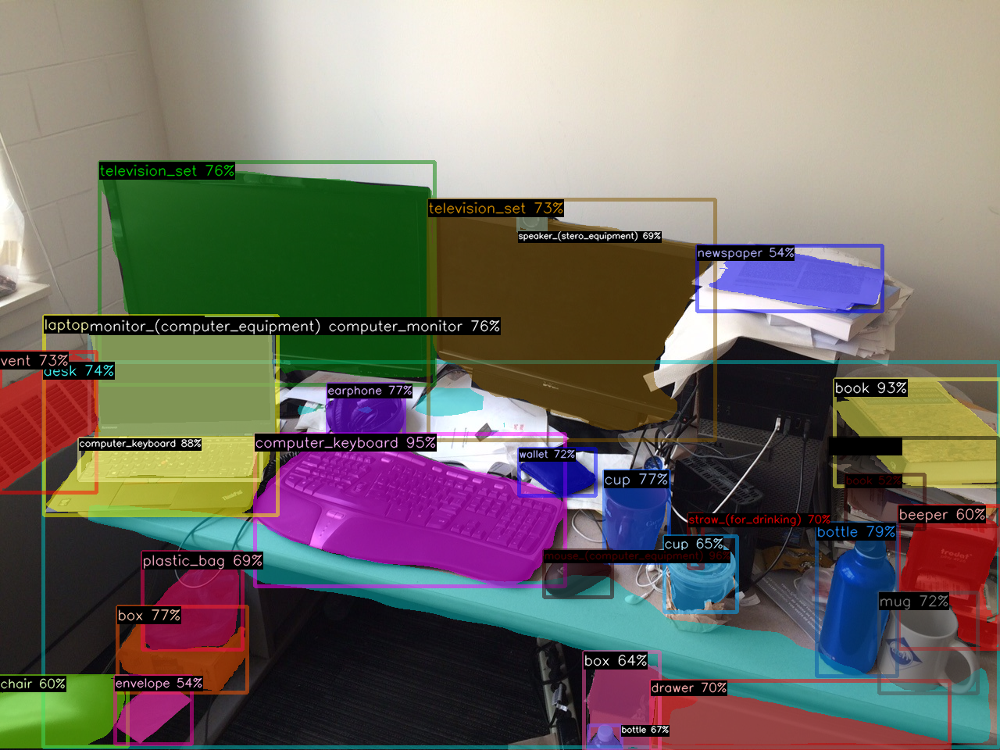

# ailia MODELS : Object Detection

## Models for bounding box

Detect bounding box of objects from single image.

|Name|mAP75|mAP50|GFlops|Resolution|Publish Date|
|-----|-----|-----|-----|-----|-----|
|[yolov7](./yolov7/)|51.72|66.17|104.7|640|2022.7|
|[yolox_l](./yolox/)|48.98|64.45|155.6|640|2021.8|
|[yolox_m](./yolox/)|46.28|62.12|73.8|640|2021.8|
|[yolov4](./yolov4/)|43.02|64.38|129.5|416|2020.4|
|[yolov6_t](./yolov6/)|40.76|57.06|36.7|640|2022.6|
|[yolox_s](./yolox/)|39.53|56.35|26.8|640|2021.8|
|[yolov3](./yolov3/)|36.94|65.23|65.86|416|2018.4|
|[yolov5s6](./yolov5/)|35.12|51.90|16.8|640|2021.10|
|[yolov5s](./yolov5/)|34.11|51.89|16.5|640|2020.6|
|[yolov7_tiny](./yolov7/)|32.34|46.96|5.8|416|2022.7|
|[yolox_tiny](./yolox/)|31.36|47.04|6.45|416|2021.8|
|[yolov6_n](./yolov6/)|29.69|43.79|4.7|416|2022.6|
|[yolox_nano](./yolox/)|24.15|39.03|1.08|416|2021.8|
|[yolov4_tiny](./yolov4-tiny/)|16.13|36.31|6.92|416|2020.4|
|[yolov3_tiny](./yolov3-tiny/)|12.65|35.76|5.56|416|2018.4|

## Metrics

### mAP (Accuracy)

Basically the accuracy of object detection algorithm is calculated by mAP. In this page, mAP was calculated using this repository.

https://github.com/axinc-ai/ailia-models-measurement/tree/main/object_detection

The repository uses Object-Detection-Metrics for mAP calculation.

https://github.com/rafaelpadilla/Object-Detection-Metrics

We used COCO2017 val images for testing. We set parameters, iou = 0.5 (mAP50) and iou = 0.75 (mAP75), detection threshold = 0.01 (Because small value achieves high accuracy).

### GFlops (Computing cost)

GFlops was referred from below site.

- yolox : https://github.com/Megvii-BaseDetection/YOLOX
- yolov5 : https://github.com/ultralytics/yolov5
- yolov4 : https://github.com/Tianxiaomo/pytorch-YOLOv4 https://docs.openvino.ai/latest/omz_models_model_yolo_v4_tiny_tf.html
- yolov3 : https://pjreddie.com/darknet/yolo/

## Models for segmentation mask

Detect bounding box and mask of objects from single image.

|Name|maskAP|Classes|Resolution|Publish Date|
|-----|-----|-----|-----|-----|
|[detic swinB](./detic/)|41.3 (LVIS-all)|1000+|800|2022.1|
|[detic Res50](./detic/)|33.2 (LVIS-all)|1000+|800|2022.1|
|[maskrcnn R_50_FPN](./maskrcnn/)|34.2 (coco)|80|800|2019.9|

## Metrics

### maskAP

maskAP was referred from below site.

- maskrcnn : https://github.com/facebookresearch/maskrcnn-benchmark/blob/main/MODEL_ZOO.md

- detic : https://github.com/facebookresearch/Detic/blob/main/docs/MODEL_ZOO.md https://arxiv.org/pdf/2201.02605.pdf

## Leader board

Object Detection
https://paperswithcode.com/task/object-detection