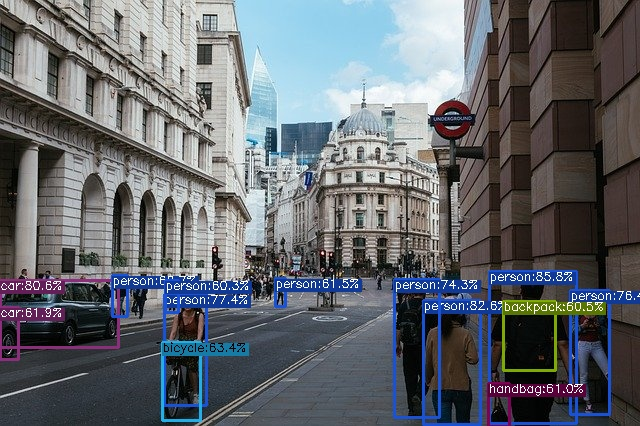

# DAMO YOLO

## Input


(Image from https://github.com/RangiLyu/nanodet/blob/main/demo_mnn/imgs/000252.jpg)

Ailia input shape: (1, 3, 640, 640)

## Output



## Usage

Automatically downloads the onnx and prototxt files on the first run. It is necessary to be connected to the Internet
while downloading.

For the sample image,

``` bash
$ python3 damoyolo.py
```

If you want to specify the input image, put the image path after the `--input` option.  
You can use `--savepath` option to change the name of the output file to save.

```bash
$ python3 damoyolo.py --input IMAGE_PATH --savepath SAVE_IMAGE_PATH
```

By adding the `--video` option, you can input the video.   
If you pass `0` as an argument to VIDEO_PATH, you can use the webcam input instead of the video file.

```bash
$ python3 damoyolo.py --video VIDEO_PATH
```

You can use `--model_name` option to change the model architecture.
```bash
$ python3 damoyolo.py --model_name damoyolo_S
```


## Reference

[damoyolo](https://github.com/tinyvision/DAMO-YOLO)

## Framework

Pytorch

## Model Format

ONNX opset = 11

## Netron

[damoyolo_T.onnx.prototxt](https://netron.app/?url=https://storage.googleapis.com/ailia-models/yolov7/damoyolo_T.onnx.prototxt)

[damoyolo_S.onnx.prototxt](https://netron.app/?url=https://storage.googleapis.com/ailia-models/yolov7/damoyolo_S.onnx.prototxt)

[damoyolo_M.onnx.prototxt](https://netron.app/?url=https://storage.googleapis.com/ailia-models/yolov7/damoyolo_M.onnx.prototxt)


