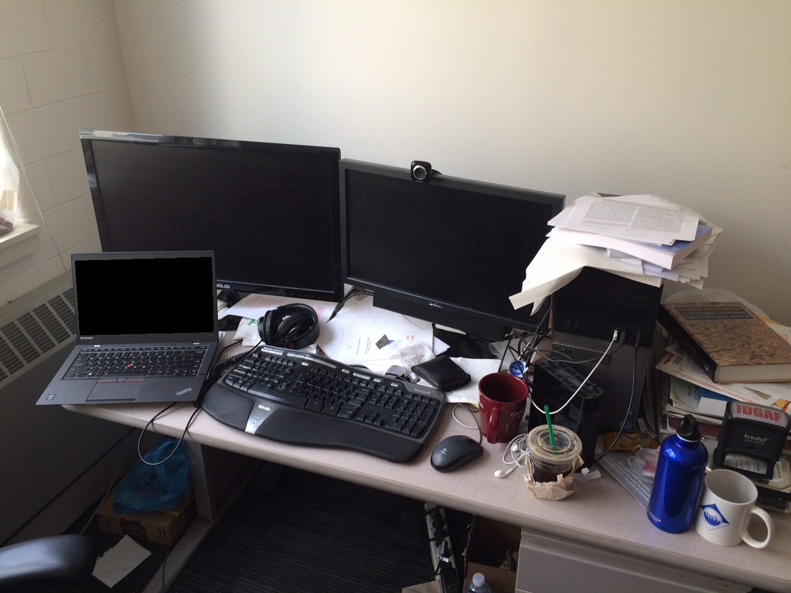

# Detecting Twenty-thousand Classes using Image-level Supervision

## Input



(Image from https://web.eecs.umich.edu/~fouhey/fun/desk/desk.jpg, credit [David Fouhey](https://web.eecs.umich.edu/~fouhey)) 

## Output


## Usage
Automatically downloads the onnx and prototxt files on the first run.
It is necessary to be connected to the Internet while downloading.

For the sample image,
```bash
$ python3 detic.py
```

If you want to specify the input image, put the image path after the `--input` option.  
You can use `--savepath` option to change the name of the output file to save.
```bash
$ python3 detic.py --input IMAGE_PATH --savepath SAVE_IMAGE_PATH
```

By adding the `--video` option, you can input the video.   
If you pass `0` as an argument to VIDEO_PATH, you can use the webcam input instead of the video file.
```bash
$ python3 detic.py --video VIDEO_PATH
```

By adding the `--vocabulary` option, you can specify the model's vocabulary which is selected from "lvis", "in21k". (default is lvis)
```bash
$ python3 detic.py --vocabulary lvis
```

## Reference

- [Detecting Twenty-thousand Classes using Image-level Supervision](https://github.com/facebookresearch/Detic)

## Framework

Pytorch

## Model Format

ONNX opset=11

## Netron

[Detic_C2_SwinB_896_4x_IN-21K+COCO_lvis.onnx.prototxt](https://netron.app/?url=https://storage.googleapis.com/ailia-models/detic/Detic_C2_SwinB_896_4x_IN-21K+COCO_lvis.onnx.prototxt)  
[Detic_C2_SwinB_896_4x_IN-21K+COCO_in21k.onnx.prototxt](https://netron.app/?url=https://storage.googleapis.com/ailia-models/detic/Detic_C2_SwinB_896_4x_IN-21K+COCO_in21k.onnx.prototxt)
