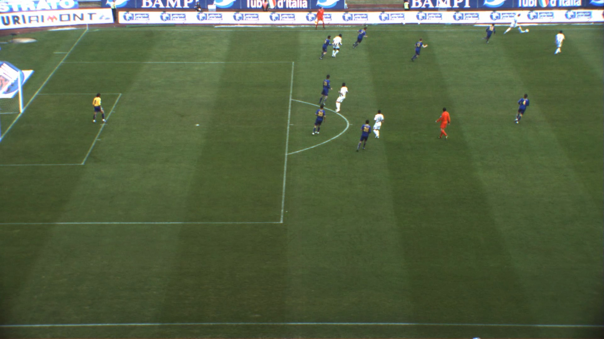

# FootAndBall: Integrated player and ball detector

## Input



This image is a part of input.mp4 and input.mp4 was created from the video in [ISSIA-CNR Soccer dataset](https://drive.google.com/file/d/1Pj6syLRShNQWQaunJmAZttUw2jDh8L_f/view)

## Output


## Usage

Automatically downloads the onnx and prototxt files on the first run. It is necessary to be connected to the Internet
while downloading.

For the sample image,

``` bash
$ python3 footandball.py
```

You can choose predicting mode in ailia and onnxruntime. The default setting is ailia and you can use onnxruntime by adding `--onnx` option as below.

``` bash
$ python3 footandball.py --onnx
```

If you want to specify the input image, put the image path after the `--input` option.  
You can use `--savepath` option to change the name of the output file to save.

```bash
$ python3 footandball.py --input IMAGE_PATH --savepath SAVE_IMAGE_PATH
```

By adding the `--video` option, you can input the video.   
If you pass `0` as an argument to VIDEO_PATH, you can use the webcam input instead of the video file.

```bash
$ python3 footandball.py --video VIDEO_PATH
```

You can customize detection threshold settings by adding `--player_threshold` and `--ball_threshold` options. The default threshold is 0.7 in both.

```bash
$ python3 footandball.py --player_threshold PLAYER_THRESHOLD
```

```bash
$ python3 footandball.py --ball_threshold BALL_THRESHOLD
```

## Reference

[FootAndBall: Integrated player and ball detector](https://github.com/jac99/FootAndBall)

## Framework

Pytorch

## Model Format

ONNX opset = 11

## Netron

[footandball.onnx.prototxt](https://netron.app/?url=https://storage.googleapis.com/ailia-models/footandball/footandball.onnx.prototxt)
