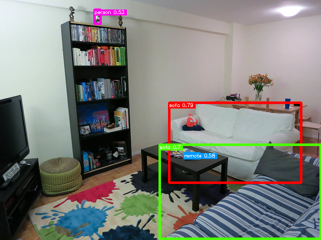

# GLIP: Grounded Language-Image Pre-training

## Input


(Image from http://farm4.staticflickr.com/3693/9472793441_b7822c00de_z.jpg)

## Output



## Requirements
This model requires additional module.

```
pip3 install transformers
pip3 install nltk
```

## Usage
Automatically downloads the onnx and prototxt files on the first run.
It is necessary to be connected to the Internet while downloading.

For the sample image,
```bash
$ python3 glip.py
```

If you want to specify the input image, put the image path after the `--input` option.  
You can use `--savepath` option to change the name of the output file to save.
```bash
$ python3 glip.py --input IMAGE_PATH --savepath SAVE_IMAGE_PATH
```

If you want to specify the caption for detection, put the caption after the `--caption` option.
```bash
$ python3 glip.py --caption "bobble heads on top of the shelf"
```

By adding the `--video` option, you can input the video.   
If you pass `0` as an argument to VIDEO_PATH, you can use the webcam input instead of the video file.
```bash
$ python3 glip.py --video VIDEO_PATH
```

## Reference

- [GLIP](https://github.com/microsoft/GLIP)

## Framework

Pytorch

## Model Format

ONNX opset=12

## Netron

[swin_tiny_bert.onnx.prototxt](https://netron.app/?url=https://storage.googleapis.com/ailia-models/glip/swin_tiny_bert.onnx.prototxt)  
[swin_tiny_backbone.onnx.prototxt](https://netron.app/?url=https://storage.googleapis.com/ailia-models/glip/swin_tiny_backbone.onnx.prototxt)  
[swin_tiny_rpn.onnx.prototxt](https://netron.app/?url=https://storage.googleapis.com/ailia-models/glip/swin_tiny_rpn.onnx.prototxt)
