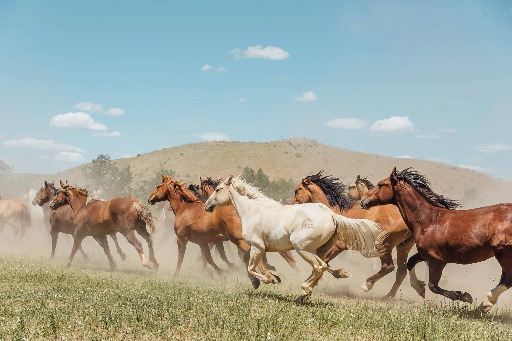
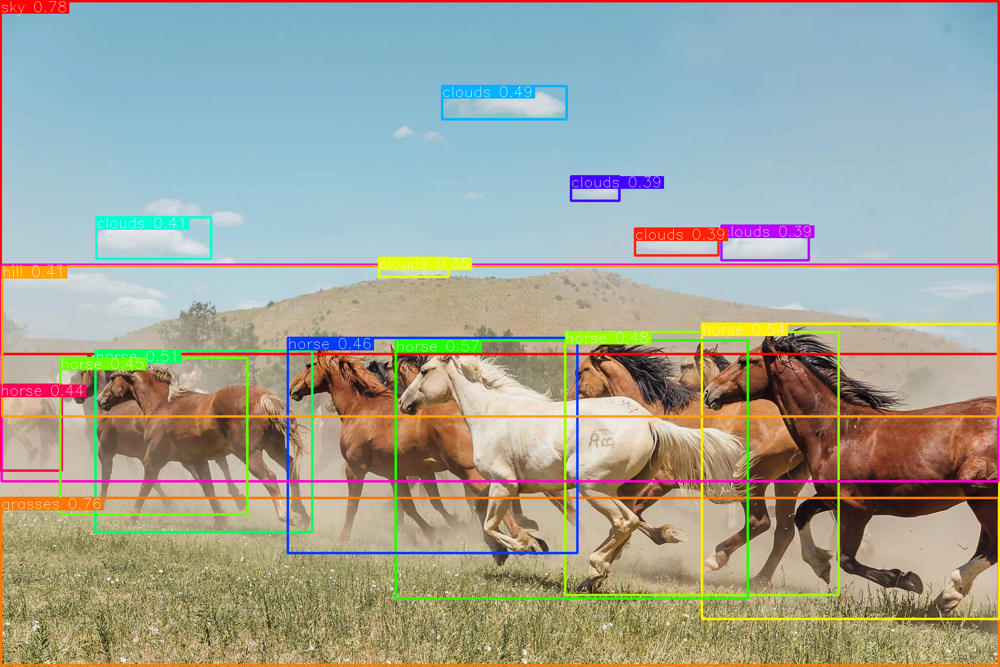

# Grounding DINO

## Input

- image


  (Image from https://github.com/IDEA-Research/Grounded-Segment-Anything/blob/main/assets/demo7.jpg)

- prompt
  ```
  Horse. Clouds. Grasses. Sky. Hill.
  ```

## Output



## Requirements
This model requires additional module.

```
pip3 install ailia_tokenizer
```

## Usage
Automatically downloads the onnx and prototxt files on the first run.
It is necessary to be connected to the Internet while downloading.

For the sample image,
```bash
$ python3 groundingdino.py
```

If you want to specify the input image, put the image path after the `--input` option.  
You can use `--savepath` option to change the name of the output file to save.
```bash
$ python3 groundingdino.py --input IMAGE_PATH --savepath SAVE_IMAGE_PATH
```

If you want to specify the caption for detection, put the caption after the `--caption` option.
If you want to detect multiple objects in one sentence, we suggest separating each name with `.` .
An example: `cat. dog. chair.`
```bash
$ python3 groundingdino.py --caption "Horse. Clouds. Grasses. Sky. Hill."
```

## Reference

- [Grounding DINO](https://github.com/IDEA-Research/GroundingDINO/tree/main)

## Framework

Pytorch

## Model Format

ONNX opset=17

## Netron

[swin_tiny_bert.onnx.prototxt](https://netron.app/?url=https://storage.googleapis.com/ailia-models/groundingdino/groundingdino_swint_ogc.onnx.prototxt)
