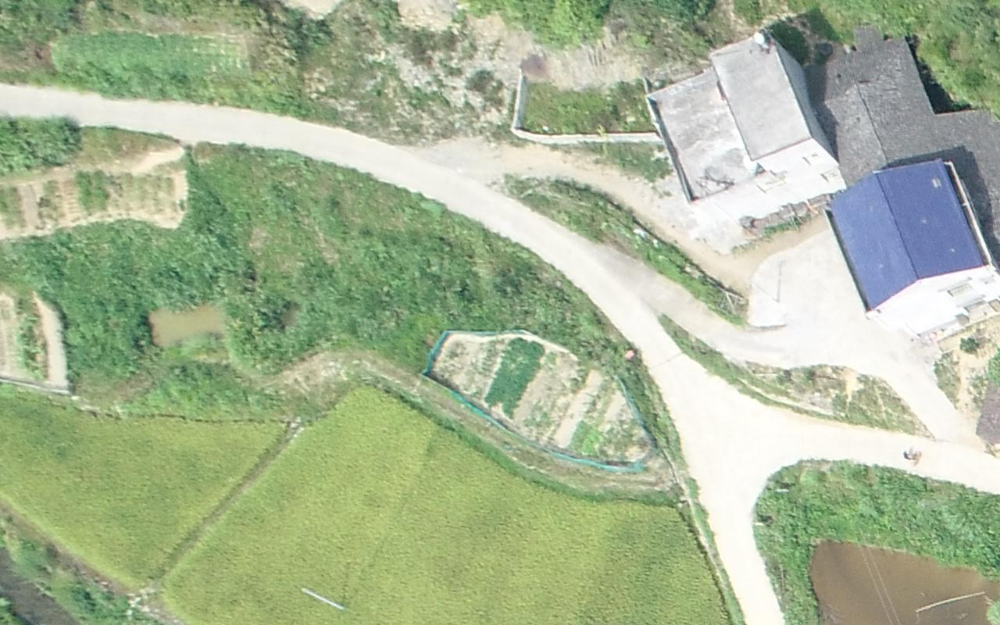
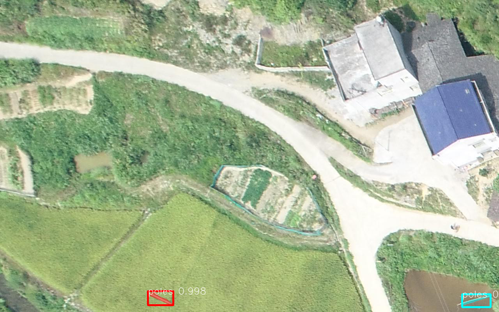

# Utility Pole Detection

### input


(from https://github.com/hiugiak/Detect-Utility-Poles/releases/tag/v1.0/)

### output


### usage
Automatically downloads the onnx and prototxt files on the first run. It is necessary to be connected to the Internet while downloading.

For the sample image,
``` bash
$ python3 main.py -o
```

If you want to specify the input image, put the image path after the `--input` option.  
You can use `--savepath` option to change the name of the output file to save.
```bash
$ python3 main.py -o --input IMAGE_PATH --savepath SAVE_IMAGE_PATH
```

By adding the `--video` option, you can input the video.   
If you pass `0` as an argument to VIDEO_PATH, you can use the webcam input instead of the video file.
```bash
$ python3 maskrcnn.py -o --video VIDEO_PATH
```

### Reference

[Detecting utility poles on aerial photographs with Mask R-CNN](https://github.com/hiugiak/Detect-Utility-Poles)


### Framework
ONNX Runtime

### Model Format
ONNX opset = 11
