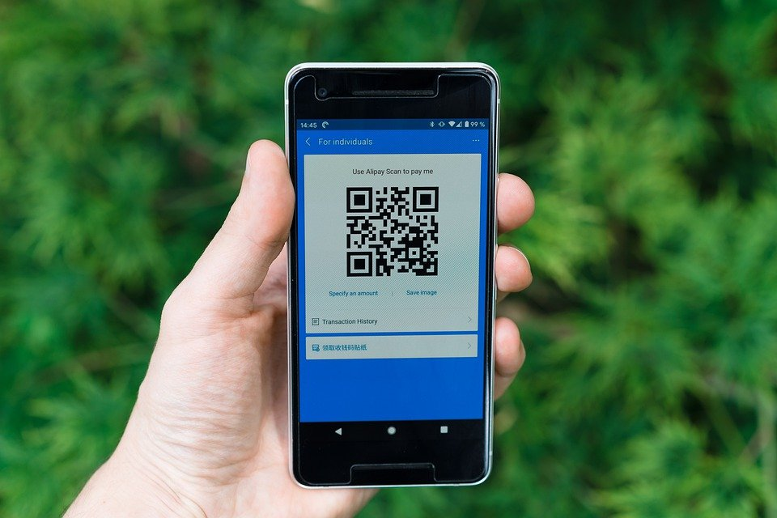

# qrcode_wechatqrcode

## Input



(Image from https://cdn.pixabay.com/photo/2020/07/18/13/52/alipay-5417261_960_720.jpg

Ailia input shape: (1, 3, 896, 1280)

## Output


## Usage

Automatically downloads the onnx and prototxt files on the first run. It is necessary to be connected to the Internet
while downloading.

Setup environments.

```
$ pip3 install -r requirements.txt
```

For the sample image,

``` bash
$ python3 qrcode_wechatqrcode.py
```

If you want to specify the input image, put the image path after the `--input` option.  
You can use `--savepath` option to change the name of the output file to save.

```bash
$ python3 qrcode_wechatqrcode.py --input IMAGE_PATH --savepath SAVE_IMAGE_PATH
```

By adding the `--video` option, you can input the video.   
If you pass `0` as an argument to VIDEO_PATH, you can use the webcam input instead of the video file.

```bash
$ python3 qrcode_wechatqrcode.py --video VIDEO_PATH
```

By adding the `--decode_qrcode` option, you can decode the qrcode using zbar.

```bash
$ python3 qrcode_wechatqrcode.py --decode_qrcode
```

## Reference

[qrcode_wechatqrcode](https://github.com/opencv/opencv_zoo/tree/4fb591053ba1201c07c68929cc324787d5afaa6c/models/qrcode_wechatqrcode)


## Model Format

Caffe v2


## Netron

[detect.prototxt](https://netron.app/?url=https://storage.googleapis.com/ailia-models/qrcode_wechatqrcode/detect.prototxt)

[sr.prototxt](https://netron.app/?url=https://storage.googleapis.com/ailia-models/qrcode_wechatqrcode/sr.prototxt)
