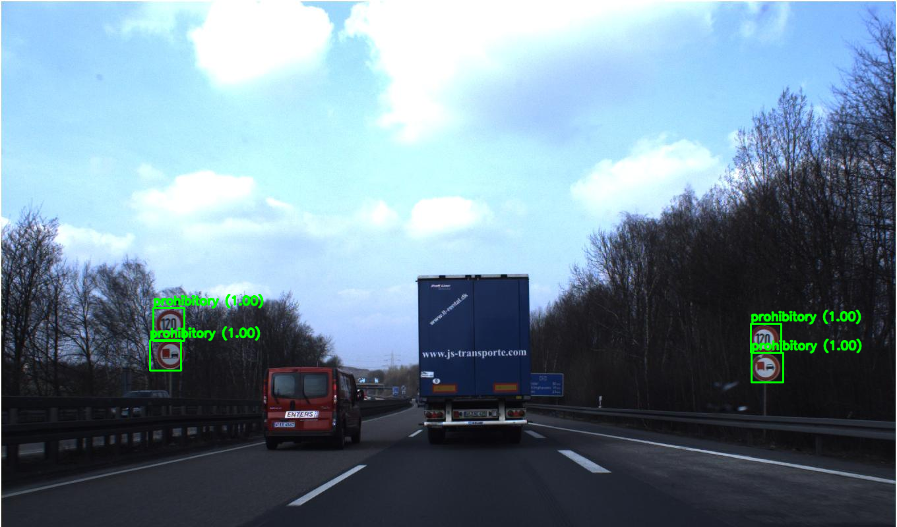

# Traffic Sign Detection

## Input


(Image from https://github.com/aarcosg/traffic-sign-detection/blob/master/test_images/image2.jpg)

## Output



## Usage
Automatically downloads the onnx and prototxt files on the first run.
It is necessary to be connected to the Internet while downloading.

For the sample image,
```bash
$ python3 traffic-sign-detection.py
```

If you want to specify the input image, put the image path after the `--input` option.  
You can use `--savepath` option to change the name of the output file to save.
```bash
$ python3 traffic-sign-detection.py --input IMAGE_PATH --savepath SAVE_IMAGE_PATH
```

By adding the `--video` option, you can input the video.   
If you pass `0` as an argument to VIDEO_PATH, you can use the webcam input instead of the video file.
```bash
$ python3 traffic-sign-detection.py --video VIDEO_PATH
```

By adding the `--model_type` option, you can specify model type which is selected from "resnet50", "inception_resnet". (default is resnet50)
```bash
$ python3 traffic-sign-detection.py --model_type resnet50
```

## Reference

- [Traffic Sign Detection](https://github.com/aarcosg/traffic-sign-detection)

## Framework

Tensorflow

## Model Format

ONNX opset=11

## Netron

[faster_rcnn_resnet50.onnx.prototxt](https://netron.app/?url=https://storage.googleapis.com/ailia-models/traffic-sign-detection/faster_rcnn_resnet50.onnx.prototxt)  
[faster_rcnn_inception_resnet_v2_atrous.onnx.prototxt](https://netron.app/?url=https://storage.googleapis.com/ailia-models/traffic-sign-detection/faster_rcnn_inception_resnet_v2_atrous.onnx.prototxt)
