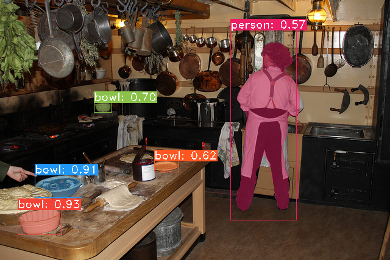

# Yolact

## Input


(Image from https://cocodataset.org/#download)

Shape : (1, 3, 550, 550)
Range : [0.0, 1.0]

## Output




## Usage
Automatically downloads the onnx and prototxt files on the first run.
It is necessary to be connected to the Internet while downloading.

For the sample image,
```bash
$ python3 yolact.py
```

If you want to specify the input image, put the image path after the `--input` option.  
You can use `--savepath` option to change the name of the output file to save.
```bash
$ python3 yolact.py --input IMAGE_PATH --savepath SAVE_IMAGE_PATH 
```

By adding the `--video` option, you can input the video.
If you pass `0` as an argument to VIDEO_PATH, you can use the webcam input instead of the video file.
```bash
$ python3 yolact.py --video VIDEO_PATH
```

## Reference

- [You Only Look At CoefficienTs](https://github.com/dbolya/yolact)

## Framework

Pytorch 1.6

Python 3.8+

## Model Format

ONNX opset=11

## Netron

[yolact.onnx.prototxt](https://netron.app/?url=https://storage.googleapis.com/ailia-models/yolact/yolact.onnx.prototxt)