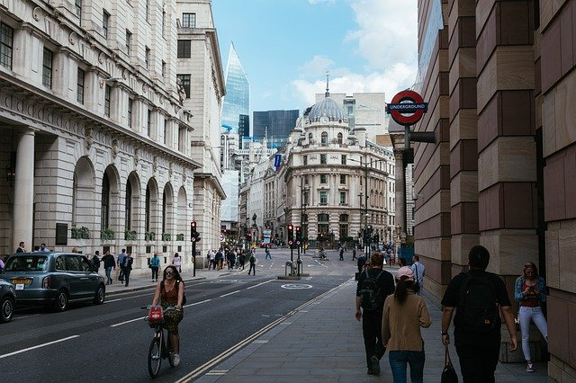

# YOLOR

## Input



(Image from https://pixabay.com/ja/photos/%E3%83%AD%E3%83%B3%E3%83%89%E3%83%B3%E5%B8%82-%E9%8A%80%E8%A1%8C-%E3%83%AD%E3%83%B3%E3%83%89%E3%83%B3-4481399/)

Ailia input shape: (1, 3, 896, 1280)

## Output


## Usage

Automatically downloads the onnx and prototxt files on the first run. It is necessary to be connected to the Internet
while downloading.

For the sample image,

``` bash
$ python3 yolor.py
```

If you want to specify the input image, put the image path after the `--input` option.  
You can use `--savepath` option to change the name of the output file to save.

```bash
$ python3 yolor.py --input IMAGE_PATH --savepath SAVE_IMAGE_PATH
```

By adding the `--video` option, you can input the video.   
If you pass `0` as an argument to VIDEO_PATH, you can use the webcam input instead of the video file.

```bash
$ python3 yolor.py --video VIDEO_PATH
```

The default setting is to use the optimized model and weights, but you can also switch to the normal model by using the
--normal option.

## Reference

[yolor](https://github.com/WongKinYiu/yolor/tree/paper)

## Framework

Pytorch

## Model Format

ONNX opset = 11

## Netron

[yolor_p6.opt.onnx.prototxt](https://netron.app/?url=https://storage.googleapis.com/ailia-models/yolor/yolor_p6.opt.onnx.prototxt)
