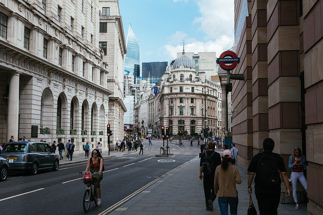

# YOLOV : for video object detection.

## Input



(Image from https://pixabay.com/ja/photos/%E3%83%AD%E3%83%B3%E3%83%89%E3%83%B3%E5%B8%82-%E9%8A%80%E8%A1%8C-%E3%83%AD%E3%83%B3%E3%83%89%E3%83%B3-4481399/)

Ailia input shape: (1, 3, 576, 576)

## Output


This model cannot detect person. (Label list : https://image-net.org/challenges/LSVRC/2015/browse-vid-synsets.php)

## Usage

Automatically downloads the onnx and prototxt files on the first run. It is necessary to be connected to the Internet
while downloading.

For the sample image,

``` bash
$ python3 yolov.py
```

If you want to specify the input image, put the image path after the `--input` option.
You can use `--savepath` option to change the name of the output file to save.

```bash
$ python3 yolov.py --input IMAGE_PATH --savepath SAVE_IMAGE_PATH
```

By adding the `--video` option, you can input the video.
If you pass `0` as an argument to VIDEO_PATH, you can use the webcam input instead of the video file.

```bash
$ python3 yolov.py --video VIDEO_PATH
```

By adding the --model option, you can specify model type which is selected from "yolov_s", "yolov_l",  "yolov_x".

```bash
$ python3 yolov.py --model MODELNAME
```

## Reference

[YOLOV](https://github.com/YuHengsss/YOLOV)

## Framework

Pytorch

## Model Format

ONNX opset = 13

## Netron

[yolov_s.onnx.prototxt](https://netron.app/?url=https://storage.googleapis.com/ailia-models/yolov/yolov_s.onnx.prototxt)

[yolov_l.onnx.prototxt](https://netron.app/?url=https://storage.googleapis.com/ailia-models/yolov/yolov_l.onnx.prototxt)

[yolov_x.onnx.prototxt](https://netron.app/?url=https://storage.googleapis.com/ailia-models/yolov/yolov_x.onnx.prototxt)
