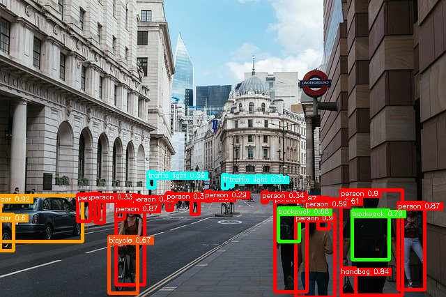

# YOLOv9

## Input


(Image from https://pixabay.com/ja/photos/%E3%83%AD%E3%83%B3%E3%83%89%E3%83%B3%E5%B8%82-%E9%8A%80%E8%A1%8C-%E3%83%AD%E3%83%B3%E3%83%89%E3%83%B3-4481399/)

Ailia input shape : (1, 3, h, w)
Range : [0.0, 1.0]
Color : RGB

## Output



## Usage
Automatically downloads the onnx and prototxt files on the first run.
It is necessary to be connected to the Internet while downloading.

For the sample image,
```bash
$ python3 yolov9.py
```

If you want to specify the input image, put the image path after the `--input` option.
You can use `--savepath` option to change the name of the output file to save.
```bash
$ python3 yolov9.py --input IMAGE_PATH --savepath SAVE_IMAGE_PATH
```

By adding the `--video` option, you can input the video.
If you pass `0` as an argument to VIDEO_PATH, you can use the webcam input instead of the video file.
```bash
$ python3 yolov9.py --video VIDEO_PATH
```

By adding the `--model_type` option, you can specify model type which is selected from "v9c", "v8e" (default is "v8e").
```bash
$ python3 yolov9.py --model_type v9c
```

You can use `--detection_size` option to change the detection resolution.
```bash
$ python3 yolov9.py --detection_size 1280
```

## Reference

- [YOLOv9](https://github.com/WongKinYiu/yolov9)

## Framework

Pytorch

## Model Format

ONNX opset=12

## Netron

- [yolov9c.onnx.prototxt](https://netron.app/?url=https://storage.googleapis.com/ailia-models/yolov9/yolov9c.onnx.prototxt)
- [yolov9e.onnx.prototxt](https://netron.app/?url=https://storage.googleapis.com/ailia-models/yolov9/yolov9e.onnx.prototxt)
