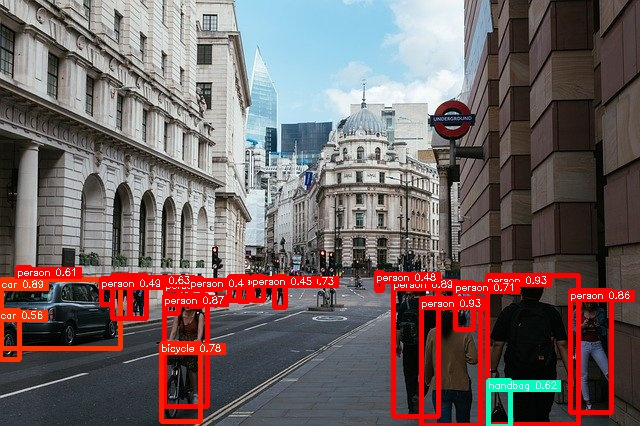

# YOLOX ti lite

## Input


(Image from https://github.com/RangiLyu/nanodet/blob/main/demo_mnn/imgs/000252.jpg)

Ailia input shape: (1, 3, 640, 640)

## Output



## Usage

Automatically downloads the onnx and prototxt files on the first run. It is necessary to be connected to the Internet
while downloading.

For the sample image,

``` bash
$ python3 yolox-ti-lite.py
```

If you want to specify the input image, put the image path after the `--input` option.  
You can use `--savepath` option to change the name of the output file to save.

```bash
$ python3 yolox-ti-lite.py --input IMAGE_PATH --savepath SAVE_IMAGE_PATH
```

By adding the `--video` option, you can input the video.   
If you pass `0` as an argument to VIDEO_PATH, you can use the webcam input instead of the video file.

```bash
$ python3 yolox-ti-lite.py --video VIDEO_PATH
```

The default setting is to use the optimized model and weights, but you can also switch to the normal model by using the
--normal option.

## Reference

[edgeai-yolox](https://github.com/TexasInstruments/edgeai-yolox)

[edigeai-modelzoo](https://github.com/TexasInstruments/edgeai-modelzoo/blob/master/modelartifacts/8bits/od-8140_onnxrt_edgeai-yolox_yolox-s-ti-lite_39p1_57p9_onnx.tar.gz.link)

## Framework

Pytorch

## Model Format

ONNX opset = 11

## Netron

Default

[yolox-s-ti-lite_39p1_57p9.onnx](https://netron.app/?url=https://storage.googleapis.com/ailia-models/yolox-ti-lite/yolox-s-ti-lite_39p1_57p9.onnx.prototxt)

Split post processing

[yolox-s-ti-lite_39p1_57p9.opt.onnx](https://netron.app/?url=https://storage.googleapis.com/ailia-models/yolox-ti-lite/yolox-s-ti-lite_39p1_57p9.opt.onnx.prototxt)

Shape inference

[yolox-s-ti-lite_39p1_57p9.opt2.onnx](https://netron.app/?url=https://storage.googleapis.com/ailia-models/yolox-ti-lite/yolox-s-ti-lite_39p1_57p9.opt2.onnx.prototxt)
