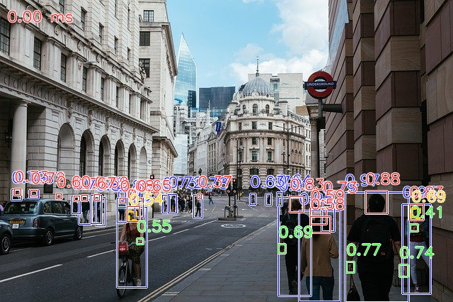

# YOLOX-Body-Head-Hand-Face

## Input


(Image from https://pixabay.com/ja/photos/%E3%83%AD%E3%83%B3%E3%83%89%E3%83%B3%E5%B8%82-%E9%8A%80%E8%A1%8C-%E3%83%AD%E3%83%B3%E3%83%89%E3%83%B3-4481399/)

Ailia input shape: (1, 3, 416, 416), (1, 3, 640, 640)

## Output



## Usage

Automatically downloads the onnx and prototxt files on the first run. It is necessary to be connected to the Internet
while downloading.

For the sample image,

``` bash
$ python3 yolox_body_head_hand_face.py
```

If you want to specify the input image, put the image path after the `--input` option.  
You can use `--savepath` option to change the name of the output file to save.

```bash
$ python3 yolox_body_head_hand_face.py --input IMAGE_PATH --savepath SAVE_IMAGE_PATH
```

By adding the `--video` option, you can input the video.   
If you pass `0` as an argument to VIDEO_PATH, you can use the webcam input instead of the video file.

```bash
$ python3 yolox_body_head_hand_face.py --video VIDEO_PATH
```

The default setting is to use the optimized model and weights, but you can also switch to the normal model by using the
--normal option.

## Reference

[YOLOX-Body-Head-Hand-Face](https://github.com/PINTO0309/PINTO_model_zoo/tree/main/434_YOLOX-Body-Head-Hand-Face)

## Framework

Onnx

## Netron

[yolox_l_body_head_hand_face_0086_0.5143_post_1x3x480x640.onnx.prototxt](https://netron.app/?url=https://storage.googleapis.com/ailia-models/yolox_body_head_hand_face/yolox_l_body_head_hand_face_0086_0.5143_post_1x3x480x640.onnx.prototxt)
