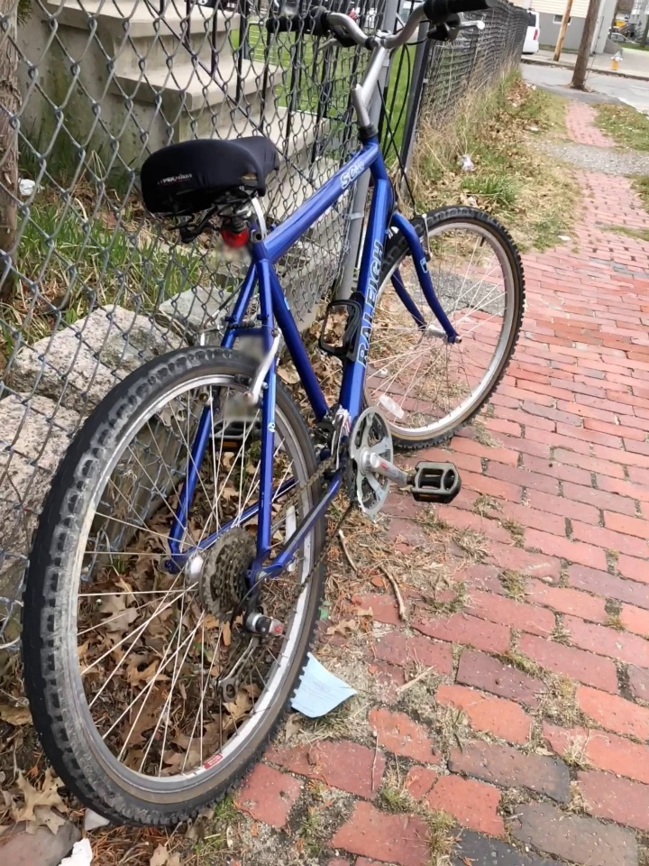
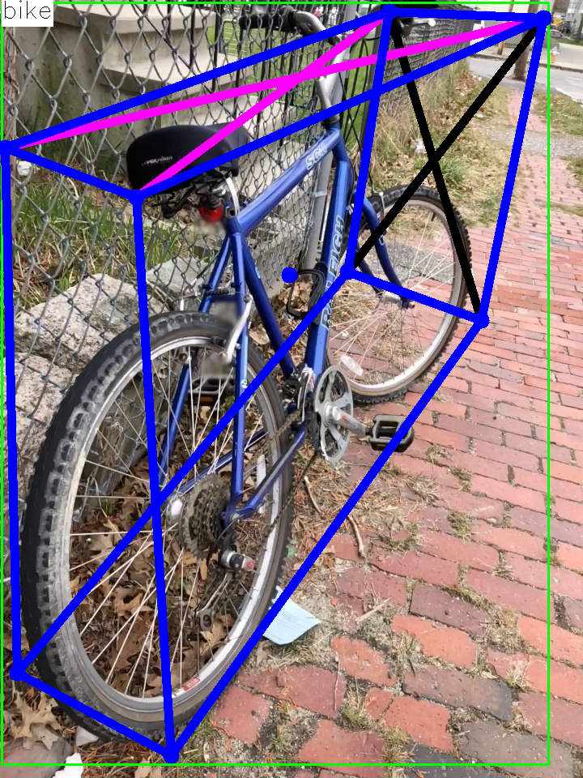

# 3d-object-detection.pytorch

## Input



(Image from Objectron Dataset https://github.com/google-research-datasets/Objectron/blob/master/notebooks/Download%20Data.ipynb)

Detection model shape : (1, 3, H, W)  
Regression model shape : (1, 3, 224, 224)  

## Output



Detection model shape : (N, 5), (N,)  
Regression model shape : (9, 1, 9, 2), (1, 9) 

## Category
```
OBJECTRON_CLASSES = [
    'bike', 'book', 'bottle', 'cereal_box', 'camera', 
    'chair', 'cup', 'laptop', 'shoe'
]
```

## Usage
Automatically downloads the onnx and prototxt files on the first run.
It is necessary to be connected to the Internet while downloading.

For the sample image,
``` bash
$ python3 3d-object-detection.pytorch.py
```

If you want to specify the input image, put the image path after the `--input` option.  
You can use `--savepath` option to change the name of the output file to save.
```bash
$ python3 3d-object-detection.pytorch.py --input IMAGE_PATH --savepath SAVE_IMAGE_PATH
```

By adding the `--video` option, you can input the video.   
If you pass `0` as an argument to VIDEO_PATH, you can use the webcam input instead of the video file.
```bash
$ python3 3d-object-detection.pytorch.py --video VIDEO_PATH
```

## Reference

- [3d-object-detection.pytorch](https://github.com/sovrasov/3d-object-detection.pytorch)
- [Objectron Dataset](https://github.com/google-research-datasets/Objectron)

## Framework

Pytorch

## Model Format

ONNX opset=11

## Netron

[mnv2_ssd_300_2_heads.onnx.prototxt](https://netron.app/?url=https://storage.googleapis.com/ailia-models/3d-object-detection.pytorch/mnv2_ssd_300_2_heads.onnx.prototxt)  
[regression_model_epoch120.onnx.prototxt](https://netron.app/?url=https://storage.googleapis.com/ailia-models/3d-object-detection.pytorch/regression_model_epoch120.onnx.prototxt)
