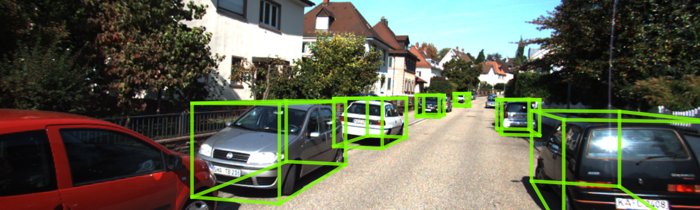

# D4LCN

## Input


(Image from http://www.cvlibs.net/datasets/kitti/eval_object.php?obj_benchmark=3d)

## Output



## Data Preparation

You need to download KITTI dataset [here](http://www.cvlibs.net/datasets/kitti/eval_object.php?obj_benchmark=3d). Download left images, calibration files.
You can download the depth maps extracted by DORN [here](https://drive.google.com/open?id=1lSJpQ8GUCxRNtWxo0lduYAbWkkXQa2cb).  
Data folder should look like this:
```
d4lcn
├── calib
  ├── xxx.txt (Camera parameters for image xxx: provided from data_object_calib.zip)
├── depth
  ├── xxx.png (depth maps for image xxx: provided from depth_2.zip)
```

## Usage
Automatically downloads the onnx and prototxt files on the first run.
It is necessary to be connected to the Internet while downloading.

For the sample image,
```bash
$ python3 d4lcn.py
```

If you want to specify the input image, put the image path after the `--input` option.  
You can use `--savepath` option to change the name of the output file to save.
```bash
$ python3 d4lcn.py --input IMAGE_PATH --savepath SAVE_IMAGE_PATH
```

The depth file and calib file are automatically found in the predetermined path.  
If you want to specify directory or directly file path, put the path after the `--calib_path` option.
```bash
$ python3 d4lcn.py --calib_path CALIB_PATH
```

You can specify directory or directly file path with the `--depth_path` option for find depth file.
```bash
$ python3 d4lcn.py --depth_path DEPTH_PATH
```

## Reference

- [D4LCN](https://github.com/dingmyu/D4LCN)

## Framework

Pytorch

## Model Format

ONNX opset=11

## Netron

[d4lcn.onnx.prototxt](https://netron.app/?url=https://storage.googleapis.com/ailia-models/d4lcn/d4lcn.onnx.prototxt)  
