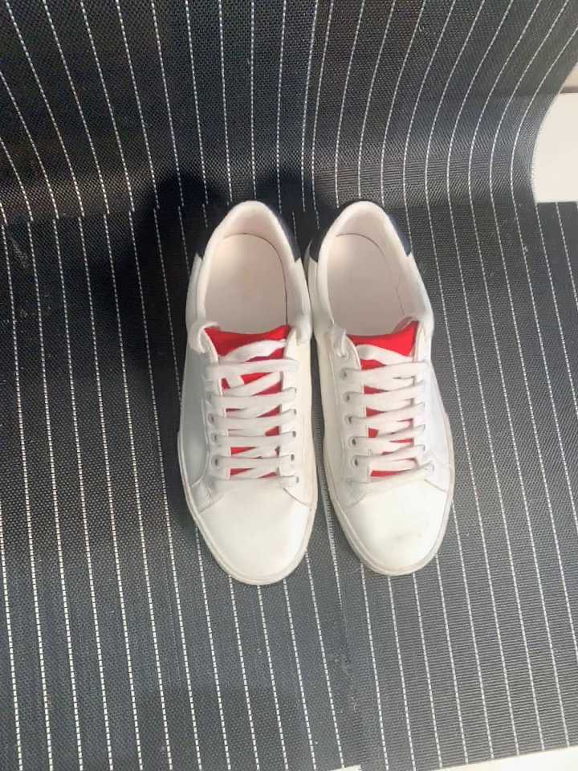

# MediaPipe Objectron

## Input



(Image from Objectron Dataset https://github.com/google-research-datasets/Objectron/blob/master/notebooks/Download%20Data.ipynb)

## Output


## Usage
Automatically downloads the onnx and prototxt files on the first run.
It is necessary to be connected to the Internet while downloading.

For the sample image,
```bash
$ python3 mediapipe_objectron.py
```

If you want to specify the input image, put the image path after the `--input` option.  
You can use `--savepath` option to change the name of the output file to save.
```bash
$ python3 mediapipe_objectron.py --input IMAGE_PATH --savepath SAVE_IMAGE_PATH
```

By adding the `--video` option, you can input the video.   
If you pass `0` as an argument to VIDEO_PATH, you can use the webcam input instead of the video file.
```bash
$ python3 mediapipe_objectron.py --video VIDEO_PATH
```

You can specify the "model type" by specifying after the `--model` option.
The model type is selected from "sneaker", "chair", "cup", "camera".  
```bash
$ python3 mediapipe_objectron.py --model sneaker
```

## Reference

- [MediaPipe](https://github.com/google/mediapipe)

## Framework

TensorFlow Lite

## Model Format

ONNX opset=11

## Netron

[object_detection_ssd_mobilenetv2_oidv4_fp16.onnx.prototxt](https://netron.app/?url=https://storage.googleapis.com/ailia-models/mediapipe_objectron/object_detection_ssd_mobilenetv2_oidv4_fp16.onnx.prototxt)  
[object_detection_3d_sneakers.onnx.prototxt](https://netron.app/?url=https://storage.googleapis.com/ailia-models/mediapipe_objectron/object_detection_3d_sneakers.onnx.prototxt)  
[object_detection_3d_chair.onnx.prototxt](https://netron.app/?url=https://storage.googleapis.com/ailia-models/mediapipe_objectron/object_detection_3d_chair.onnx.prototxt)  
[object_detection_3d_cup.onnx.prototxt](https://netron.app/?url=https://storage.googleapis.com/ailia-models/mediapipe_objectron/object_detection_3d_cup.onnx.prototxt)  
[object_detection_3d_camera.onnx.prototxt](https://netron.app/?url=https://storage.googleapis.com/ailia-models/mediapipe_objectron/object_detection_3d_camera.onnx.prototxt)
