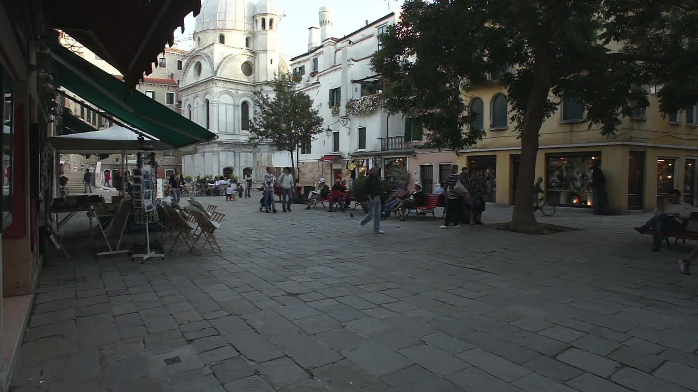

# ByteTrack

## Input



(Video from https://vimeo.com/60139361)

## Output


## Requirements
This model requires additional module.

```
pip3 install lap
```

## Usage
Automatically downloads the onnx and prototxt files on the first run.
It is necessary to be connected to the Internet while downloading.

For the sample video,
```bash
$ python3 bytetrack.py
```

If you want to specify the video image, put the file path after the `--video` option.  
You can use `--savepath` option to specify the name of the output file to save.
```bash
$ python3 bytetrack.py --video VIDEO_PATH --savepath SAVE_FILE_PATH
```

By adding the `--model_type` option, you can specify model type which is selected from below. (default is mot17_x)

- mot17_x (800x1440)
- mot17_s (608x1088)
- mot20_x (896x1600)
- yolox_s (640x640)
- yolox_tiny (416x416)

The values in parentheses represent the size of the image given to the model.  
The models whose names start with "yolox" are pure models from yolox. On the other hand, the models starting with "mot" are fine-tuned models based on the yolox model.

```bash
$ python3 bytetrack.py --model_type mot17_x
```

## Reference

- [ByteTrack](https://github.com/ifzhang/ByteTrack)

## Framework

Pytorch

## Model Format

ONNX opset=11

## Netron

[bytetrack_x_mot17.onnx.prototxt](https://netron.app/?url=https://storage.googleapis.com/ailia-models/bytetrack/bytetrack_x_mot17.onnx.prototxt)  
[bytetrack_x_mot20.onnx.prototxt](https://netron.app/?url=https://storage.googleapis.com/ailia-models/bytetrack/bytetrack_x_mot20.onnx.prototxt)  
