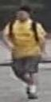
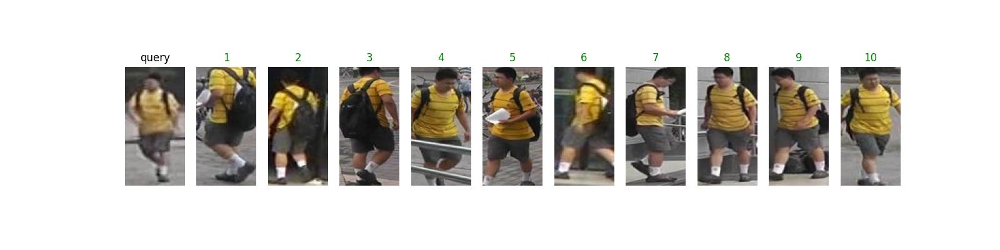

# CTL-Model : On the Unreasonable Effectiveness of Centroids in Image Retrieval

## Input (query)



(Image from http://188.138.127.15:81/Datasets/Market-1501-v15.09.15.zip)

Shape : (batch, 3, height, width)

## Output (Top 10 images from gallery images that are similar to query)



## Usage
Automatically downloads the onnx and prototxt files on the first run.
It is necessary to be connected to the Internet while downloading.

For the sample image,
``` bash
$ python3 centroids-reid.py
```

If you want to specify the input image, put the image path after the `--input` option.  
You can use `--savepath` option to change the name of the output file to save.
```bash
$ python3 centroids-reid.py --input IMAGE_PATH --savepath SAVE_IMAGE_PATH
```

If you want to specify the directory of gallery image, put the directory path after the `--gallery_dir` option.
```bash
$ python3 centroids-reid.py --gallery_dir gallery
```
Now, files in this gallery directory are very restricted.   
Many more files can be found in the bounding_box_test directory of [Market-1501-v15.09.15.zip](http://188.138.127.15:81/Datasets/Market-1501-v15.09.15.zip).


By adding the model name after the `--model` option, you can specify the model.  
The model name is selected from 'market1501_resnet50', 'dukemtmcreid_resnet50'.
```bash
$ python3 centroids-reid.py --model market1501_resnet50
```

## Reference

- [On the Unreasonable Effectiveness of Centroids in Image Retrieval](https://github.com/mikwieczorek/centroids-reidh)

## Framework

Pytorch

## Model Format

ONNX opset=11

## Netron

[market1501_resnet50_256_128_epoch_120.onnx.prototxt](https://netron.app/?url=https://storage.googleapis.com/ailia-models/centroids-reid/market1501_resnet50_256_128_epoch_120.onnx.prototxt)   
[dukemtmcreid_resnet50_256_128_epoch_120.onnx.prototxt](https://netron.app/?url=https://storage.googleapis.com/ailia-models/centroids-reid/dukemtmcreid_resnet50_256_128_epoch_120.onnx.prototxt)
