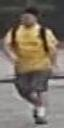

# UTS-Person-reID-Practical

## Input (query)



(Image from http://188.138.127.15:81/Datasets/Market-1501-v15.09.15.zip)

Shape : (batch, 3, height, width)

## Output (Top 10 images from gallery images that are similar to query)


## Usage
Automatically downloads the onnx and prototxt files on the first run.
It is necessary to be connected to the Internet while downloading.

For the sample image,
``` bash
$ python3 person_reid_baseline_pytorch.py
```

If you want to specify the input image, put the image path after the `--input` option.  
You can use `--savepath` option to change the name of the output file to save.
```bash
$ python3 person_reid_baseline_pytorch.py --input IMAGE_PATH --savepath SAVE_IMAGE_PATH
```

If you want to specify the directory of gallery image, put the directory path after the `--gallery_dir` option.
```bash
$ python3 person_reid_baseline_pytorch.py --gallery_dir gallery
```
Now, files in this gallery directory are very restricted.   
Many more files can be found in the bounding_box_test directory of [Market-1501-v15.09.15.zip](http://188.138.127.15:81/Datasets/Market-1501-v15.09.15.zip).

Once the program run, a intermediate result file containing the features of the gallery image will be created.  
By adding the intermediate result file name after the `--data` option, you can use the intermediate result of the previous inference.
```bash
$ python3 person_reid_baseline_pytorch.py --data result_resnet50.npy
```

By adding the model name after the `--model` option, you can specify the model.  
The model name is selected from 'resnet50', 'fp16', 'dense', 'pcb'.
```bash
$ python3 person_reid_baseline_pytorch.py --model resnet50
```

## Reference

- [UTS-Person-reID-Practical](https://github.com/layumi/Person_reID_baseline_pytorch)

## Framework

Pytorch

## Model Format

ONNX opset=11

## Netron

[ft_ResNet50.onnx.prototxt](https://netron.app/?url=https://storage.googleapis.com/ailia-models/person_reid_baseline_pytorch/ft_ResNet50.onnx.prototxt)
[fp16.onnx.prototxt](https://netron.app/?url=https://storage.googleapis.com/ailia-models/person_reid_baseline_pytorch/fp16.onnx.prototxt)
[ft_net_dense.onnx.prototxt](https://netron.app/?url=https://storage.googleapis.com/ailia-models/person_reid_baseline_pytorch/ft_net_dense.onnx.prototxt)
[PCB.onnx.prototxt](https://netron.app/?url=https://storage.googleapis.com/ailia-models/person_reid_baseline_pytorch/PCB.onnx.prototxt)
