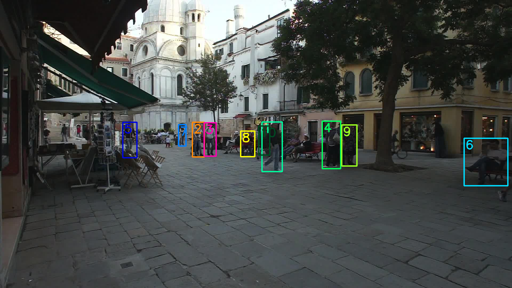

# StrongSORT

## Input


(Video from https://vimeo.com/60139361)

## Output



## Usage
This sample code uses the same model as bytetrack for object detection.

Automatically downloads the onnx and prototxt files on the first run.
It is necessary to be connected to the Internet while downloading.

For the sample video,
```bash
$ python3 strong_sort.py
```

If you want to specify the video image, put the file path after the `--video` option.  
You can use `--savepath` option to specify the name of the output video file to save.
```bash
$ python3 strong_sort.py --video VIDEO_PATH --savepath SAVE_FILE_PATH
```

Two lightweight and plug-and-play algorithms are presented to further refine the tracking results. (StrongSORT++)

Firstly, an appearance-free link model (AFLink) is proposed to associate short tracklets into complete trajectories.
```bash
$ python3 strong_sort.py --AFLink
```

Secondly, Gaussian Smoothed Interpolation (GSI) is proposed to compensate for missing detections.
```bash
$ python3 strong_sort.py --GSI
```

By adding the `--model_type` option, you can specify model type which is selected from below. (default is mot17_x)

- mot17_x (800x1440)
- mot17_s (608x1088)
- mot17_tiny (416x416)
- mot20_x (896x1600)
- yolox_s (640x640)
- yolox_tiny (416x416)

The values in parentheses represent the size of the image given to the model.  
The models whose names start with "yolox" are pure models from yolox. On the other hand, the models starting with "mot" are fine-tuned models based on the yolox model.

```bash
$ python3 strong_sort.py --model_type mot17_x
```

## Reference

- [StrongSORT](https://github.com/dyhBUPT/StrongSORT)
- [FastReID](https://github.com/JDAI-CV/fast-reid)

## Framework

Pytorch

## Model Format

ONNX opset=11

## Netron

[AFLink_epoch20.onnx.prototxt](https://netron.app/?url=https://storage.googleapis.com/ailia-models/strong_sort/AFLink_epoch20.onnx.prototxt)  
[duke_bot_S50.onnx.prototxt](https://netron.app/?url=https://storage.googleapis.com/ailia-models/strong_sort/duke_bot_S50.onnx.prototxt)  
