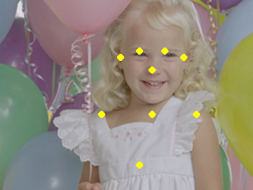

# OpenPose

## Input

Shape : (1, 3, 240, 320)
Range : [0, 255]

## Output

- Confidence : (1, 19, 30, 40)
- Range : [0, 1.0]

## Note

OPENPOSE: MULTIPERSON KEYPOINT DETECTION
SOFTWARE LICENSE AGREEMENT
ACADEMIC OR NON-PROFIT ORGANIZATION NONCOMMERCIAL RESEARCH USE ONLY

## Reference

[Code repo for realtime multi-person pose estimation in CVPR'17 (Oral)](https://github.com/ZheC/Realtime_Multi-Person_Pose_Estimation)

## Framework

Caffe

## Model Format

CaffeModel