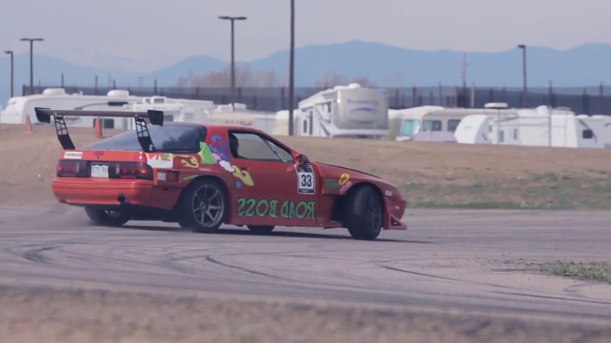
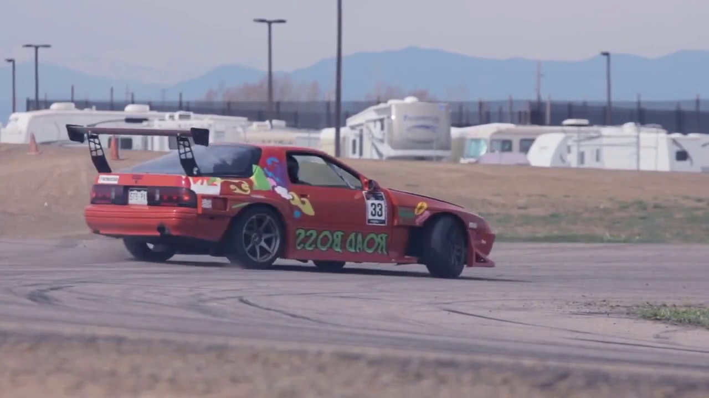

# RAFT: Recurrent All Pairs Field Transforms for Optical Flow

## input



(from https://pixabay.com/videos/car-racing-motor-sports-action-74/)

<br/>

## output


<br/>

## usage
Automatically downloads the onnx and prototxt files on the first run.
It is necessary to be connected to the Internet while downloading.

For the sample image,
``` bash
$ python raft.py
(ex on CPU)  $ python raft.py -e 0
(ex on BLAS) $ python raft.py -e 1
(ex on GPU)  $ python raft.py -e 2
```

If you want to specify the input images, put the two images path after the `--inputs` option.
Specify the frame images in the video in the order of front and back.
You can use `--savepath` option to change the name of the output file to save.
```bash
$ python3 raft.py --inputs IMAGE_PATH_BEFORE_FRAME IMAGE_PATH_AFTER_FRAME --savepath SAVE_IMAGE_PATH
$ python3 raft.py -i IMAGE_PATH_BEFORE_FRAME IMAGE_PATH_AFTER_FRAME -s SAVE_IMAGE_PATH
(ex) $ python3 raft.py --inputs input_before.png input_after.png --savepath output.png
```

By adding the `--video` option, you can input the video.
```bash
$ python3 raft.py --video VIDEO_PATH --savepath SAVE_VIDEO_PATH
$ python3 raft.py -v VIDEO_PATH -s SAVE_VIDEO_PATH
(ex) $ python3 raft.py --video input.mp4 --savepath output.mp4
```

<br/>

## Reference

[RAFT: Recurrent All Pairs Field Transforms for Optical Flow (https://github.com/princeton-vl/RAFT)

<br/>

## Framework
Pytorch

<br/>

## Model Format
ONNX opset = 11

<br/>

## Netron

[raft-things_fnet.onnx.prototxt](https://netron.app/?url=https://storage.googleapis.com/ailia-models/raft/raft-things_fnet.onnx.prototxt)<br/>
[raft-things_cnet.onnx.prototxt](https://netron.app/?url=https://storage.googleapis.com/ailia-models/raft/raft-things_cnet.onnx.prototxt)<br/>
[raft-things_update_block.onnx.prototxt](https://netron.app/?url=https://storage.googleapis.com/ailia-models/raft/raft-things_update_block.onnx.prototxt)<br/>
[raft-small_fnet.onnx.prototxt](https://netron.app/?url=https://storage.googleapis.com/ailia-models/raft/raft-small_fnet.onnx.prototxt)<br/>
[raft-small_cnet.onnx.prototxt](https://netron.app/?url=https://storage.googleapis.com/ailia-models/raft/raft-small_cnet.onnx.prototxt)<br/>
[raft-small_update_block.onnx.prototxt](https://netron.app/?url=https://storage.googleapis.com/ailia-models/raft/raft-small_update_block.onnx.prototxt)<br/>