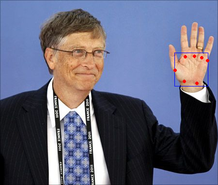

# BlazePose

## Input


(Image from https://www.pinterest.com/pin/472244710905655341/)

- ailia input shape: (1, 3, 256, 256)
- Pixel value range: [0, 1]

## Output



- ailia Predict API output:
  - Bounding boxes
    - Shape: (1, 896, 18)
  - Classification confidences
    - Shape: (1, 896, 1)

## Usage

Automatically downloads the onnx and prototxt files on the first run.
It is necessary to be connected to the Internet while downloading.

For the sample image,
``` bash
$ python3 blazepalm.py 
```

If you want to specify the input image, put the image path after the `--input` option.  
You can use `--savepath` option to change the name of the output file to save.
```bash
$ python3 blazepalm.py --input IMAGE_PATH --savepath SAVE_IMAGE_PATH
```

By adding the `--video` option, you can input the video.   
If you pass `0` as an argument to VIDEO_PATH, you can use the webcam input instead of the video file.
```bash
$ python3 blazepalm.py --video VIDEO_PATH --savepath SAVE_VIDEO_PATH
```

## Reference

[MediaPipePyTorch](https://github.com/zmurez/MediaPipePyTorch)

## Framework

PyTorch 1.7.1


## Model Format

ONNX opset = 11

