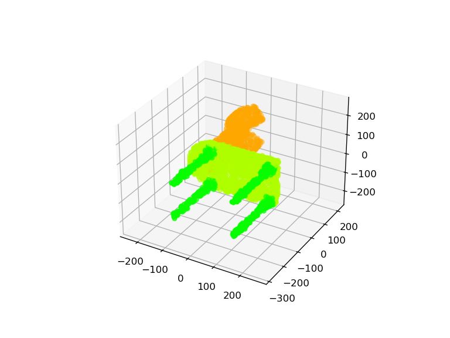

# PointNet.pytorch

## Input



(Image from http://web.stanford.edu/~ericyi/project_page/part_annotation/index.html)

- Segmentation model Input Shape : (1, 3, N)
- Classification model Input Shape : (batch, 3, N)

## Output


- Segmentation model output shape
    - pred shape : (1, N, Seg_class)
    - trans shape : (1, 3, 3)
- Classification model output shape
    - pred shape : (batch, 16)
    - trans shape : (batch, 3, 3)

## Usage
Automatically downloads the onnx and prototxt files on the first run.
It is necessary to be connected to the Internet while downloading.

For the sample image,
``` bash
$ python3 pointnet_pytorch.py
```

You can specify the "class" by specifying after the `--choice_class` option.  
The class is selected from airplane, bag, cap, car, chair, earphone, guitar, knife, lamp, laptop, motorbike, mug, pistol, rocket, skateboard, table.  
```bash
$ python3 pointnet_pytorch.py --choice-class CLASS
```

If you want to specify the input point, put the .pts file path after the `--input` option.  
You can use `--savepath` option to change the name of the output file to save.
```bash
$ python3 pointnet_pytorch.py --input POINT_FILE_PATH --savepath SAVE_IMAGE_PATH
```


## Reference

- [PointNet.pytorch](https://github.com/fxia22/pointnet.pytorch)

## Framework

Pytorch

## Model Format

ONNX opset=11

## Netron

[airplane_100.onnx.prototxt](https://netron.app/?url=https://storage.googleapis.com/ailia-models/pointnet_pytorch/airplane_100.onnx.prototxt)
[bag_100.onnx.prototxt](https://netron.app/?url=https://storage.googleapis.com/ailia-models/pointnet_pytorch/bag_100.onnx.prototxt)
[cap_100.onnx.prototxt](https://netron.app/?url=https://storage.googleapis.com/ailia-models/pointnet_pytorch/cap_100.onnx.prototxt)
[car_100.onnx.prototxt](https://netron.app/?url=https://storage.googleapis.com/ailia-models/pointnet_pytorch/car_100.onnx.prototxt)
[chair_100.onnx.prototxt](https://netron.app/?url=https://storage.googleapis.com/ailia-models/pointnet_pytorch/chair_100.onnx.prototxt)
[earphone_100.onnx.prototxt](https://netron.app/?url=https://storage.googleapis.com/ailia-models/pointnet_pytorch/earphone_100.onnx.prototxt)
[guitar_100.onnx.prototxt](https://netron.app/?url=https://storage.googleapis.com/ailia-models/pointnet_pytorch/guitar_100.onnx.prototxt)
[knife_100.onnx.prototxt](https://netron.app/?url=https://storage.googleapis.com/ailia-models/pointnet_pytorch/knife_100.onnx.prototxt)
[lamp_100.onnx.prototxt](https://netron.app/?url=https://storage.googleapis.com/ailia-models/pointnet_pytorch/lamp_100.onnx.prototxt)
[laptop_100.onnx.prototxt](https://netron.app/?url=https://storage.googleapis.com/ailia-models/pointnet_pytorch/laptop_100.onnx.prototxt)
[motorbike_100.onnx.prototxt](https://netron.app/?url=https://storage.googleapis.com/ailia-models/pointnet_pytorch/motorbike_100.onnx.prototxt)
[mug_100.onnx.prototxt](https://netron.app/?url=https://storage.googleapis.com/ailia-models/pointnet_pytorch/mug_100.onnx.prototxt)
[pistol_100.onnx.prototxt](https://netron.app/?url=https://storage.googleapis.com/ailia-models/pointnet_pytorch/pistol_100.onnx.prototxt)
[rocket_100.onnx.prototxt](https://netron.app/?url=https://storage.googleapis.com/ailia-models/pointnet_pytorch/rocket_100.onnx.prototxt)
[skateboard_100.onnx.prototxt](https://netron.app/?url=https://storage.googleapis.com/ailia-models/pointnet_pytorch/skateboard_100.onnx.prototxt)
[table_100.onnx.prototxt](https://netron.app/?url=https://storage.googleapis.com/ailia-models/pointnet_pytorch/table_100.onnx.prototxt)
[cls_model_100.onnx.prototxt](https://netron.app/?url=https://storage.googleapis.com/ailia-models/pointnet_pytorch/cls_model_100.onnx.prototxt)
