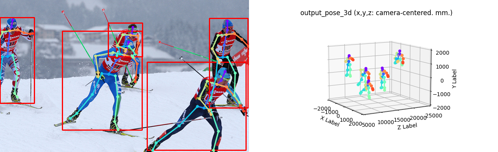

# PoseNet of "Camera Distance-aware Top-down Approach for 3D Multi-person Pose Estimation from a Single RGB Image"

### input


(from https://github.com/mks0601/3DMPPE_POSENET_RELEASE/tree/master/demo)

### output


### usage
Automatically downloads the onnx and prototxt files on the first run.
It is necessary to be connected to the Internet while downloading.

For the sample image,
``` bash
$ python3 demo.py --onnx
```

If you want to specify the input image, put the image path after the `--input` option.  
You can use `--savepath` option to change the name of the output file to save.
```bash
$ python3 maskrcnn.py --onnx --input IMAGE_PATH --savepath SAVE_IMAGE_PATH
```

By adding the `--video` option, you can input the video.
```bash
$ python3 maskrcnn.py --onnx --video VIDEO_PATH --savepath SAVE_VIDEO_PATH
```

### Reference

[PoseNet of "Camera Distance-aware Top-down Approach for 3D Multi-person Pose Estimation from a Single RGB Image"](https://github.com/mks0601/3DMPPE_POSENET_RELEASE)


### Framework
ONNX Runtime

### Model Format
ONNX opset = 10


### Netron

[rootnet_snapshot_18.opt.onnx.prototxt](https://netron.app/?url=https://storage.googleapis.com/ailia-models/3dmppe_posenet/rootnet_snapshot_18.opt.onnx.prototxt)
[posenet_snapshot_24.opt.onnx.prototxt](https://netron.app/?url=https://storage.googleapis.com/ailia-models/3dmppe_posenet/posenet_snapshot_24.opt.onnx.prototxt)
